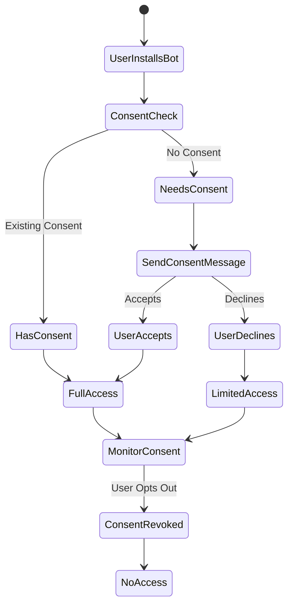

## Slack App Display Information Configuration

The **Display Information** section is critical for making your Slack app discoverable and appealing in the Slack Marketplace. The answers will reflect the system's purpose as an intelligent, automated affiliate outreach tool, emphasizing its backend-driven features like prospect discovery, personalized messaging, and analytics, as outlined in the architecture documents.

#### 1. **App Name**

**Recommendation**:  
`Affiliate Outreach Bot`

**Reason**:  

- The name `Affiliate Outreach Bot` is concise, descriptive, and consistent with the system's identity as an autonomous affiliate outreach tool, as described in both architecture documents (e.g., **Executive Vision**).  
- It aligns with the naming convention used for the Discord integration (`affiliate_outreach`), reinforcing brand consistency across platforms.  
- The term "Bot" clearly indicates that this is an automated, interactive application within Slack, which fits the **Agentic Intelligence Framework**'s autonomous behaviors (prospecting, engagement, learning).  

Affiliate Outreach Bot

#### 2. **Short Description**

**Recommendation**:  
"An AI-powered bot that automates affiliate outreach in Slack. Discovers prospects, sends personalized messages, and provides real-time campaign analytics."

**Character Count**: 139 (Slack typically allows ~140 characters for short descriptions)  
**Reason**:  

- This concise description highlights the core functionalities of the system:  
  - **Prospect Discovery**: Leverages the **Multi-Platform Discovery Engine** to identify high-potential affiliates.  
  - **Personalized Messaging**: Utilizes the **Dynamic Outreach Orchestration** and **Intelligent Personalization Engine** for context-aware communication.  
  - **Real-Time Analytics**: Reflects the **Data Architecture & Intelligence Layer** and **Real-Time Dashboard Architecture** capabilities.  
- It emphasizes Slack as the communication channel, aligning with the **Multi-Channel Campaign Architecture** that supports platforms like Email, LinkedIn, and now Slack.  
- The description is engaging and marketable, appealing to Slack users looking for automation and analytics, as per the **Human-Centric Design** principle.

An AI-powered bot that automates affiliate outreach in Slack. Discovers prospects, sends personalized messages, and provides real-time campaign analytics.

#### 3. **App Icon & Preview**

**Recommendation**:  

- **App Icon**: Upload a 512x512 PNG or JPG image with a professional design representing the affiliate outreach system.  
- **Preview**: Optionally upload additional screenshots (e.g., 1280x800 PNG/JPG) showing the bot in action (e.g., sample Slack messages or analytics reports) when available.  
- **Design Suggestions**:  
  - Use a clean, modern logo with a stylized "A" (for Affiliate) or a network graph motif to reflect the **Knowledge Graph Architecture**.  
  - Incorporate colors that match the **Background Color** (e.g., shades of #2C2D30 or complementary tones).  
  - Ensure the icon is simple, recognizable at small sizes, and aligns with the **Human-Centric Design** principle for approachability.

**Reason**:  

- A professional app icon enhances the bot’s visibility and credibility in the Slack Marketplace, aligning with the system’s branding as an intelligent, autonomous tool (Executive Vision).  
- Since the frontend isn’t implemented yet, you can create a placeholder icon using design tools (e.g., Canva, Figma) or hire a designer to craft one that reflects the **Technical Implementation Details** (e.g., modern, React-inspired aesthetics).  
- Previews can be added later when the **Intelligent User Interface Framework** is built, showcasing Slack interactions in the **Smart Prospect Discovery Dashboard** or **Conversational Analytics Platform**.  
- For now, focus on the icon, as it’s required for app submission. Store the icon file in your backend’s **Object Storage** (Scalability & Performance Architecture) for easy access.

Upload a 512x512 PNG/JPG icon with a stylized "A" or network graph motif. Use colors matching #2C2D30. Ensure a clean, modern design for Slack Marketplace visibility.

#### 4. **Background Color**

**Recommendation**:  
`#2C2D30`

**Reason**:  

- The color `#2C2D30` (a dark gray) is professional, modern, and aligns with the **Frontend Technologies** (e.g., Tailwind CSS, React 18+) aesthetic described in the frontend architecture, which emphasizes clean, dark-themed UI elements.  
- It complements Slack’s default dark mode, ensuring visual consistency for users interacting with the bot in Slack channels or DMs.  
- This color also matches the **Human-Centric Design** principle by providing a neutral, non-distracting backdrop for bot messages and embeds (e.g., analytics visualizations from the **Advanced Data Visualization Engine**).  
- The backend’s **Integration Ecosystem** can use this color for branded Slack message embeds, ensuring a cohesive experience.

# 2C2D30

#### 5. **Long Description**

**Recommendation**:  

```
**Affiliate Outreach Bot: Intelligent Affiliate Marketing Automation**

Transform your affiliate marketing with the Affiliate Outreach Bot, an AI-powered Slack app that automates prospect discovery, engagement, and campaign management. Leveraging advanced AI, this bot:

- **Discovers High-Potential Affiliates**: Scans platforms like LinkedIn and Twitter to identify prospects with high engagement and relevance, using behavioral analysis and scoring algorithms.
- **Sends Personalized Messages**: Crafts context-aware outreach messages in Slack, tailored to each prospect’s profile and preferences, with automated follow-ups.
- **Provides Real-Time Analytics**: Delivers actionable insights through interactive dashboards, tracking campaign performance, response rates, and ROI.
- **Streamlines Team Collaboration**: Integrates with your Slack workspace for seamless campaign approvals, shared analytics, and team coordination.
- **Ensures Ethical Outreach**: Adheres to privacy-first principles, with consent management and compliance with GDPR, CCPA, and CAN-SPAM.

Built with a scalable, autonomous architecture, the Affiliate Outreach Bot learns from every interaction to optimize strategies. Perfect for marketers seeking to scale affiliate networks efficiently.

**Key Features**:
- Multi-platform prospect discovery
- AI-driven message personalization
- Real-time campaign monitoring
- Collaborative campaign management
- Comprehensive analytics and reporting

**Get Started**:
Add the Affiliate Outreach Bot to your Slack workspace and revolutionize your affiliate outreach today!

[Terms of Service](https://affiliate-outreach.com/terms) | [Privacy Policy](https://affiliate-outreach.com/privacy)
```

**Character Count**: ~900 (Slack allows rich text with formatting, no strict character limit, but aim for clarity and brevity)  
**Reason**:  

- The long description serves as a marketing pitch in the Slack Marketplace, detailing the bot’s value proposition and capabilities, as outlined in the architecture documents:  
  - **Prospect Discovery**: Ties to the **Multi-Platform Discovery Engine** and **Behavioral Pattern Recognition**.  
  - **Personalized Messaging**: Reflects the **Dynamic Outreach Orchestration** and **Intelligent Personalization Engine**.  
  - **Real-Time Analytics**: Aligns with the **Data Intelligence Layer** and **Real-Time Dashboard Architecture**.  
  - **Collaboration**: Leverages the **Interactive Campaign Management** and backend’s **Collaborative Features**.  
  - **Ethical Outreach**: Emphasizes the **Security & Compliance Framework** and **Privacy-First Design**.  
- The use of bold text, bullet points, and links (to Terms and Privacy Policy) enhances readability and aligns with Slack’s **App Detail Guidelines**.  
- It highlights the bot’s integration with Slack as a communication channel, supported by the **Multi-Channel Campaign Architecture**, and prepares for future frontend features like the **Smart Prospect Discovery Dashboard**.  
- The call-to-action encourages immediate adoption, aligning with the **Scalability & Performance Architecture**’s goal of handling widespread use.

**Affiliate Outreach Bot: Intelligent Affiliate Marketing Automation**

Transform your affiliate marketing with the Affiliate Outreach Bot, an AI-powered Slack app that automates prospect discovery, engagement, and campaign management. Leveraging advanced AI, this bot:

- **Discovers High-Potential Affiliates**: Scans platforms like LinkedIn and Twitter to identify prospects with high engagement and relevance, using behavioral analysis and scoring algorithms.
- **Sends Personalized Messages**: Crafts context-aware outreach messages in Slack, tailored to each prospect’s profile and preferences, with automated follow-ups.
- **Provides Real-Time Analytics**: Delivers actionable insights through interactive dashboards, tracking campaign performance, response rates, and ROI.
- **Streamlines Team Collaboration**: Integrates with your Slack workspace for seamless campaign approvals, shared analytics, and team coordination.
- **Ensures Ethical Outreach**: Adheres to privacy-first principles, with consent management and compliance with GDPR, CCPA, and CAN-SPAM.

Built with a scalable, autonomous architecture, the Affiliate Outreach Bot learns from every interaction to optimize strategies. Perfect for marketers seeking to scale affiliate networks efficiently.

**Key Features**:

- Multi-platform prospect discovery
- AI-driven message personalization
- Real-time campaign monitoring
- Collaborative campaign management
- Comprehensive analytics and reporting

**Get Started**:
Add the Affiliate Outreach Bot to your Slack workspace and revolutionize your affiliate outreach today!

[Terms of Service](https://affiliate-outreach.com/terms) | [Privacy Policy](https://affiliate-outreach.com/privacy)

---

### Additional Guidance for Slack Integration

To ensure a successful Slack integration, consider how the **Display Information** settings align with the broader Slack App configuration and your system’s architecture. Since the frontend isn’t implemented, the backend will handle most interactions. Here’s how to proceed:

1. **Slack API Credentials**:  
   - After configuring the **Display Information**, obtain the following from the Slack API Developer Portal:  
     - **Client ID** and **Client Secret** (from **Basic Information**): For OAuth2 authentication. Store securely in the backend’s environment variables (e.g., using **FastAPI** with **AWS Secrets Manager**, per **Security & Compliance Framework**).  
     - **Bot User OAuth Token** (from **OAuth & Permissions**): For authenticating the bot to send messages and interact in Slack.  
     - **Signing Secret** (from **Basic Information**): For verifying Slack request signatures.  
   - These credentials are equivalent to the Discord API keys and will be used by the **Integration Ecosystem** to connect with Slack.

2. **OAuth2 and Permissions**:  
   - In the Slack Developer Portal, configure **OAuth & Permissions**:  
     - **Redirect URLs**: Add `https://api.affiliate-outreach.com/slack/oauth2/callback` to handle OAuth2 callbacks, processed by the backend’s **API Gateway**.  
     - **Bot Token Scopes**: Request scopes like:  
       - `chat:write` (to send messages, e.g., personalized outreach).  
       - `commands` (to support slash commands, e.g., `/prospect_search`).  
       - `channels:read`, `users:read` (to discover prospects within Slack workspaces).  
       - `app_mentions:read`, `messages:write` (to handle responses and interactions).  
     - These scopes align with the **Multi-Channel Executor** and **Intelligent Response Processing** for Slack communication.  
   - Generate an OAuth2 install URL (e.g., from **OAuth & Permissions**) to share with users, similar to Discord’s install link.

3. **Slack Event Subscriptions**:  
   - Enable **Event Subscriptions** in the Slack Developer Portal and set an **Event Endpoint URL**:  
     **Suggested URL**: `https://api.affiliate-outreach.com/slack/events`  
   - Subscribe to events like:  
     - `message.channels`, `message.im` (to process prospect responses).  
     - `app_mention` (to handle bot mentions).  
     - `member_joined_channel` (to track potential prospects in Slack workspaces).  
   - The backend’s **FastAPI** can handle these events, routing them to the **Response Intelligence Layer** for intent classification and response generation.  
   - Example FastAPI endpoint for Slack events:

```python
from fastapi import FastAPI, Request, HTTPException
from slack_sdk.signature import SignatureVerifier

app = FastAPI()
SLACK_SIGNING_SECRET = "your-signing-secret-here"
verifier = SignatureVerifier(SLACK_SIGNING_SECRET)

@app.post("/slack/events")
async def handle_slack_events(request: Request):
    raw_body = await request.body()
    timestamp = request.headers.get("X-Slack-Request-Timestamp")
    signature = request.headers.get("X-Slack-Signature")
    
    if not verifier.is_valid_request(raw_body, timestamp, signature):
        raise HTTPException(status_code=401, detail="Invalid request signature")
    
    data = await request.json()
    # Route to Response Intelligence Layer
    return await process_slack_event(data)
```

```python
from fastapi import FastAPI, Request, HTTPException
from slack_sdk.signature import SignatureVerifier

app = FastAPI()
SLACK_SIGNING_SECRET = "your-signing-secret-here"
verifier = SignatureVerifier(SLACK_SIGNING_SECRET)

@app.post("/slack/events")
async def handle_slack_events(request: Request):
    raw_body = await request.body()
    timestamp = request.headers.get("X-Slack-Request-Timestamp")
    signature = request.headers.get("X-Slack-Signature")
    
    if not verifier.is_valid_request(raw_body, timestamp, signature):
        raise HTTPException(status_code=401, detail="Invalid request signature")
    
    data = await request.json()
    # Route to Response Intelligence Layer
    return await process_slack_event(data)
```

4. **Slash Commands**:  
   - Create slash commands in the Slack Developer Portal (under **Slash Commands**) to enable user interactions, such as:  
     - `/prospect_search`: Queries the **Multi-Platform Discovery Engine** for affiliates.  
     - `/campaign_stats`: Retrieves real-time campaign metrics from the **Data Intelligence Layer**.  
     - `/outreach_start`: Initiates a personalized outreach campaign via the **Dynamic Outreach Orchestration**.  
   - Set the **Request URL** for commands to:  
     `https://api.affiliate-outreach.com/slack/commands`  
   - These commands integrate with the **Conversational Analytics Platform**’s backend NLP for natural language processing.

5. **Backend Integration**:  
   - Treat Slack as a communication channel in the **Multi-Channel Campaign Architecture**, alongside Discord, Email, etc.  
   - Use the **Intelligent Response Processing** pipeline to classify Slack message intents (e.g., interest level, objections) and generate replies via the **Response Generator**.  
   - Store Slack user and workspace data in the **Knowledge Graph DB** as **Prospect Entities** or **Platform Entities**, enabling scoring and campaign tracking (Data Architecture & Intelligence Layer).  
   - Leverage the **Integration Orchestrator** to sync Slack interactions with other platforms (e.g., CRM Systems, Analytics Platforms).

6. **Security and Compliance**:  
   - Verify Slack request signatures using the **Signing Secret** (Security & Compliance Framework).  
   - Encrypt Slack tokens and user data in the **Data Layer** (Data Security).  
   - Implement **Consent Management** for Slack users, ensuring compliance with GDPR, CCPA, and CAN-SPAM (Privacy Consent Flow).  
   - Example consent flow for Slack users:




7. **Scalability**:  
   - The **Horizontal Scaling Architecture** ensures the backend can handle Slack’s real-time events via **Message Queue** and **Sharded Cache**.  
   - Use the **WebSocket Client** (State Management & Data Flow) or Slack’s **Events API** for real-time message handling.  
   - The **Load Balancer Layer** and **CDN** can optimize Slack API responses and asset delivery (e.g., message embeds).

8. **Future Frontend Integration**:  
   - When implementing the frontend, use the **Intelligent User Interface Framework** to display Slack interactions in the **Smart Prospect Discovery Dashboard** or **Real-Time Dashboard**.  
   - Integrate Slack’s OAuth2 flow into the **Authentication Manager** for user login.  
   - Enable natural language queries for Slack campaign data via the **Conversational Analytics Platform** (e.g., “Show Slack outreach stats”).  
   - Visualize Slack analytics in the **Advanced Data Visualization Engine** using **Interactive Charts** or **Network Graphs**.

---

### Summary of API Keys Needed for Slack

1. **Client ID**: Obtain from the Slack Developer Portal (Basic Information).  
   - Used for OAuth2 authentication.  
2. **Client Secret**: Obtain from the Slack Developer Portal (Basic Information).  
   - For OAuth2; store securely in the backend.  
3. **Bot User OAuth Token**: Obtain from OAuth & Permissions after app installation.  
   - For Slack API calls (e.g., sending messages).  
4. **Signing Secret**: Obtain from Basic Information.  
   - For verifying Slack request signatures.  

---

### Next Steps

1. **Complete Display Information**: Enter the recommended values in the Slack Developer Portal’s **App Configuration** > **Display Information** section.  
2. **Upload App Icon**: Create and upload a 512x512 icon, storing it in the backend’s **Object Storage**.  
3. **Obtain API Credentials**: Copy the **Client ID**, **Client Secret**, and **Signing Secret** from the Developer Portal. Generate a **Bot User OAuth Token** after configuring OAuth2.  
4. **Set Up Endpoints**: Implement **Events** (`/slack/events`) and **Commands** (`/slack/commands`) endpoints in **FastAPI**, ensuring signature verification.  
5. **Configure OAuth2 and Scopes**: Add the redirect URL and request the recommended bot scopes in **OAuth & Permissions**.  
6. **Create Slash Commands**: Register commands like `/prospect_search` in the Developer Portal.  
7. **Test Integration**: Use Slack’s **Test Your App** feature to simulate interactions and ensure the backend processes events correctly.  
8. **Plan for Frontend**: When ready, extend the **Intelligent User Interface Framework** to visualize Slack data and interactions.

This configuration aligns with your project’s architecture, leveraging its autonomous intelligence, multi-channel capabilities, and real-time analytics to create a robust Slack-integrated affiliate outreach system. Let me know if you need code snippets, further endpoint implementation details, or assistance with other Slack configuration sections (e.g., OAuth2, Event Subscriptions)!

To complete the Slack App configuration for your **Agentic Affiliate Outreach System**, as described in the `BACKEND_ARCHITECTURE.md` and `FRONTEND_ARCHITECTURE.md` documents, I’ll provide tailored answers for the specified sections in the Slack Developer Portal. Since you haven’t implemented the frontend yet, the integration will leverage the backend’s autonomous intelligence, multi-channel orchestration, and real-time analytics capabilities. The answers will align with the system’s architecture, ensuring compatibility with future frontend development, and address the **Display Information** discrepancies noted in the provided **App Manifest** (e.g., background color `#344682` vs. `#2C2D30`).

Below, I’ll address each section you’ve listed, providing recommendations that integrate with the backend’s **FastAPI**, **Integration Ecosystem**, **Intelligent Response Processing**, and **Data Intelligence Layer**. I’ll also ensure consistency with the previously provided **Display Information** and prepare for Slack-specific features like slash commands, webhooks, and event subscriptions.

---

### Slack App Configuration Sections and Recommended Answers

#### 1. **App Home**

**Overview**:  
The App Home includes three tabs (Home, Messages, About) that enhance user interactions with your bot. The Home tab can display interactive **Block Kit** components, the Messages tab shows direct messages, and the About tab pulls from the **Display Information** section. Since the frontend isn’t implemented, the backend will drive interactions via **FastAPI** endpoints, with Block Kit components generated dynamically.

**Recommendations**:

- **App Home Image**:  
  **Action**: Upload a 1280x800 PNG/JPG image showcasing the bot’s functionality (e.g., a mockup of a Slack Home tab with prospect search results or analytics).  
  **Design Suggestions**:  
  - Use a clean, modern design with the bot’s icon (512x512, as uploaded in **Display Information**) and sample Block Kit elements (e.g., buttons for `/prospect_search`, analytics cards).  
  - Incorporate the background color `#2C2D30` for consistency (correcting the manifest’s `#344682`).  
  - Store the image in the backend’s **Object Storage** (Scalability & Performance Architecture).  
  **Reason**: A professional image enhances the App Home’s appeal, aligning with the **Human-Centric Design** principle. It can be a placeholder until the frontend visualizes Slack interactions.

Upload a 1280x800 PNG/JPG mockup of the bot’s Home tab with prospect search or analytics. Use #2C2D30 background, bot icon, and Block Kit elements. Store in Object Storage.

- **Scopes for Bot Token**:  
  **Action**: Add the following bot token scopes in **OAuth & Permissions** > **Bot Token Scopes**:  
  - `chat:write` (to send messages, e.g., personalized outreach).  
  - `commands` (to support slash commands, e.g., `/prospect_search`).  
  - `im:history`, `im:write`, `im:read` (to enable the Messages tab and process direct messages).  
  - `users:read`, `users:read.email` (to identify prospects within Slack workspaces).  
  - `app_mentions:read` (to handle bot mentions).  
  - `channels:read`, `channels:history` (to interact in public channels for campaign updates).  

  **Reason**:  
  - These scopes enable the bot to perform key actions (Dynamic Outreach Orchestration, Intelligent Response Processing) and display the Home and Messages tabs.  
  - `im:history`, `im:write`, `im:read` are required for the Messages tab to show direct message interactions, aligning with the **Multi-Channel Executor**.  
  - `users:read` and `channels:read` support prospect discovery within Slack (Multi-Platform Discovery Engine).  
  - The backend’s **Integration Orchestrator** will use these scopes to authenticate API calls via the **Bot User OAuth Token**.

Add scopes: chat:write, commands, im:history, im:write, im:read, users:read, users:read.email, app_mentions:read, channels:read, channels:history.

- **Show Tabs**:  
  **Action**: Enable both **Home Tab** and **Messages Tab**.  
  **Home Tab Configuration**:  
  - Use **Block Kit** to create an interactive Home tab with components like:  
    - A welcome message: “Welcome to Affiliate Outreach Bot! Start discovering affiliates or check campaign stats.”  
    - Buttons for actions: “Search Prospects” (triggers `/prospect_search`), “View Analytics” (triggers `/campaign_stats`).  
    - A card displaying recent campaign metrics (fetched from the **Data Intelligence Layer**).  
  - Example Block Kit JSON for the Home tab (served by the backend):

```json
{
  "type": "home",
  "blocks": [
    {
      "type": "section",
      "text": {
        "type": "mrkdwn",
        "text": "*Welcome to Affiliate Outreach Bot!* Start discovering affiliates or check campaign stats."
      }
    },
    {
      "type": "actions",
      "elements": [
        {
          "type": "button",
          "text": {
            "type": "plain_text",
            "text": "Search Prospects"
          },
          "action_id": "prospect_search"
        },
        {
          "type": "button",
          "text": {
            "type": "plain_text",
            "text": "View Analytics"
          },
          "action_id": "campaign_stats"
        }
      ]
    },
    {
      "type": "section",
      "text": {
        "type": "mrkdwn",
        "text": "*Recent Campaign Metrics*\nResponse Rate: 12% | Conversions: 45"
      }
    }
  ]
}
```

```json
{
  "type": "home",
  "blocks": [
    {
      "type": "section",
      "text": {
        "type": "mrkdwn",
        "text": "*Welcome to Affiliate Outreach Bot!* Start discovering affiliates or check campaign stats."
      }
    },
    {
      "type": "actions",
      "elements": [
        {
          "type": "button",
          "text": {
            "type": "plain_text",
            "text": "Search Prospects"
          },
          "action_id": "prospect_search"
        },
        {
          "type": "button",
          "text": {
            "type": "plain_text",
            "text": "View Analytics"
          },
          "action_id": "campaign_stats"
        }
      ]
    },
    {
      "type": "section",
      "text": {
        "type": "mrkdwn",
        "text": "*Recent Campaign Metrics*\nResponse Rate: 12% | Conversions: 45"
      }
    }
  ]
}
```

  **Messages Tab Configuration**:  

- Enable to display direct messages sent by the bot (e.g., personalized outreach messages or analytics reports).  
- The backend’s **Response Generator** will send messages via the `chat:write` scope, processed by the **Intelligent Response Processing** pipeline.  

  **About Tab**:  

- No action needed; it automatically pulls from the **Display Information** (e.g., Long Description). Ensure the **Display Information** is accurate (correct `#344682` to `#2C2D30` in the manifest).  

  **Reason**:  

- The Home tab enhances user engagement with interactive components, aligning with the **Conversational Analytics Platform**’s goal of intuitive interactions.  
- The Messages tab supports direct communication, critical for the **Dynamic Outreach Orchestration**’s personalized messaging.  
- The backend’s **FastAPI** can serve dynamic Block Kit content via an endpoint (e.g., `/slack/home`), integrating with the **Data Intelligence Layer** for metrics.

- **Implementation**:  
  - Create a **FastAPI** endpoint to handle Home tab updates:

```python
from fastapi import FastAPI, Request
from slack_sdk.signature import SignatureVerifier

app = FastAPI()
SLACK_SIGNING_SECRET = "your-signing-secret-here"
verifier = SignatureVerifier(SLACK_SIGNING_SECRET)

@app.post("/slack/home")
async def handle_home_tab(request: Request):
    raw_body = await request.body()
    timestamp = request.headers.get("X-Slack-Request-Timestamp")
    signature = request.headers.get("X-Slack-Signature")
    
    if not verifier.is_valid_request(raw_body, timestamp, signature):
        return {"error": "Invalid request signature"}, 401
    
    data = await request.json()
    # Fetch metrics from Data Intelligence Layer
    metrics = await fetch_campaign_metrics()
    # Return Block Kit JSON
    return {
        "type": "home",
        "blocks": [
            {
                "type": "section",
                "text": {
                    "type": "mrkdwn",
                    "text": f"*Recent Campaign Metrics*\nResponse Rate: {metrics.response_rate}%"
                }
            }
        ]
    }
```

```python
from fastapi import FastAPI, Request
from slack_sdk.signature import SignatureVerifier

app = FastAPI()
SLACK_SIGNING_SECRET = "your-signing-secret-here"
verifier = SignatureVerifier(SLACK_SIGNING_SECRET)

@app.post("/slack/home")
async def handle_home_tab(request: Request):
    raw_body = await request.body()
    timestamp = request.headers.get("X-Slack-Request-Timestamp")
    signature = request.headers.get("X-Slack-Signature")
    
    if not verifier.is_valid_request(raw_body, timestamp, signature):
        return {"error": "Invalid request signature"}, 401
    
    data = await request.json()
    # Fetch metrics from Data Intelligence Layer
    metrics = await fetch_campaign_metrics()
    # Return Block Kit JSON
    return {
        "type": "home",
        "blocks": [
            {
                "type": "section",
                "text": {
                    "type": "mrkdwn",
                    "text": f"*Recent Campaign Metrics*\nResponse Rate: {metrics.response_rate}%"
                }
            }
        ]
    }
```

#### 2. **Agents & AI Apps**

**Overview**:  
This feature enables a top-bar entry point and side-by-side view for AI-powered conversations, replacing the Messages tab with Chat and History tabs. It’s ideal for your system’s **Conversational Analytics Platform**, which supports natural language queries.

**Recommendations**:  

- **Agent or Assistant**:  
  **Action**: Enable this feature.  
  **Reason**:  
  - The **Conversational Analytics Platform** uses backend NLP (Natural Language Processing Stack) to process queries like “Show campaign performance trends.” Enabling this feature provides a dedicated AI assistant interface in Slack, enhancing user experience.  
  - The side-by-side view aligns with the **Human-Centric Design** principle, making it easier for users to interact with the bot for prospect discovery or analytics.  
  - The backend’s **Response Generator** and **Intent Recognition** can handle AI-driven conversations, feeding results to the Chat tab.

- **Implementation Requirements**:  
  - **Request URL**: Configure in **Event Subscriptions** (see below).  
    **Suggested URL**: `https://api.affiliate-outreach.com/slack/events`  
  - **Scopes**: Ensure `chat:write`, `im:write`, and `app_mentions:read` are added to support AI conversations.  
  - **Org-Level Access**: If targeting Enterprise Grid organizations, enable **Org-Readiness** (see below) to make the app available org-wide.  

- **Example Interaction**:  
  - User types: “Find tech influencers in Slack.”  
  - Backend’s **NLP Processor** parses the query, queries the **Multi-Platform Discovery Engine**, and returns results via a Block Kit message in the Chat tab:

```json
{
  "type": "section",
  "text": {
    "type": "mrkdwn",
    "text": "Found 3 tech influencers:\n- @user1: 10k followers\n- @user2: 8k followers"
  }
}
```

```json
{
  "type": "section",
  "text": {
    "type": "mrkdwn",
    "text": "Found 3 tech influencers:\n- @user1: 10k followers\n- @user2: 8k followers"
  }
}
```

#### 3. **Workflow Steps**

**Overview**:  
Workflow Steps allow your app to integrate with Slack’s Workflow Builder, enabling custom functions (e.g., triggering an outreach campaign). Since no steps are created, this can be deferred unless you want to support specific workflows.

**Recommendations**:  

- **Action**: Skip for now or create a basic step.  
  **Suggested Step (if implemented)**:  
  - **Callback ID**: `trigger_outreach`  
  - **Name**: `Start Outreach Campaign`  
  - **Access**: Org-level (requires **Org-Readiness**).  
  - **Function**: Triggers a campaign via the **Dynamic Outreach Orchestration** when a user completes a workflow step (e.g., approving a prospect list).  

- **Reason**:  
  - Workflow Steps enhance collaboration (Interactive Campaign Management), but require additional backend logic to handle step execution.  
  - The backend’s **Integration Orchestrator** can process step events, integrating with the **Campaign Planner**.  
  - Deferring this avoids complexity until the frontend supports workflow visualization (e.g., **Visual Campaign Builder**).  

- **Implementation (if needed)**:  
  - Create a **FastAPI** endpoint for step execution:

```python
@app.post("/slack/workflow/trigger_outreach")
async def handle_workflow_step(request: Request):
    data = await request.json()
    # Trigger campaign via Dynamic Outreach Orchestration
    campaign_id = await start_outreach_campaign(data["prospect_list"])
    return {"status": "success", "campaign_id": campaign_id}
```

```python
@app.post("/slack/workflow/trigger_outreach")
async def handle_workflow_step(request: Request):
    data = await request.json()
    # Trigger campaign via Dynamic Outreach Orchestration
    campaign_id = await start_outreach_campaign(data["prospect_list"])
    return {"status": "success", "campaign_id": campaign_id}
```

#### 4. **Enable Org-Readiness**

**Overview**:  
Org-Readiness allows the app to be installed once at the organization level, with access managed across workspaces. It’s required for features like Workflow Steps and org-wide AI agents.

**Recommendations**:  

- **Action**: Enable **Org-Readiness**.  
- **Reason**:  
  - Enables scalability for Enterprise Grid organizations, aligning with the **Scalability & Performance Architecture**.  
  - Supports org-wide features like Workflow Steps and AI Agents, enhancing the **Collaborative Features** (Interactive Campaign Management).  
  - The backend’s **Integration Orchestrator** can handle org-level permissions, storing workspace data in the **Knowledge Graph DB**.  

- **Implementation**:  
  - Update the **App Manifest** to set `"org_deploy_enabled": true`:

```yaml
settings:
  org_deploy_enabled: true
  socket_mode_enabled: false
  token_rotation_enabled: false
```

```yaml
settings:
  org_deploy_enabled: true
  socket_mode_enabled: false
  token_rotation_enabled: false
```

#### 5. **Incoming Webhooks**

**Overview**:  
Incoming Webhooks allow external sources to post messages to Slack channels via HTTP requests. Each installation generates a unique webhook URL.

**Recommendations**:  

- **Action**: Activate **Incoming Webhooks**.  
- **Reason**:  
  - Enables the backend to send automated messages (e.g., outreach messages, analytics updates) to Slack channels or DMs, aligning with the **Multi-Channel Executor**.  
  - The **Dynamic Outreach Orchestration** can use webhooks for high-volume messaging, reducing API call overhead.  
  - Webhook URLs are stored securely in the **Data Layer** (Data Security).  

- **Implementation**:  
  - After activation, retrieve the webhook URL post-installation and store it in the **Knowledge Graph DB**.  
  - Example **FastAPI** function to send a webhook message:

```python
import httpx

async def send_slack_webhook(webhook_url: str, message: str):
    payload = {
        "text": message,
        "blocks": [
            {
                "type": "section",
                "text": {"type": "mrkdwn", "text": message}
            }
        ]
    }
    async with httpx.AsyncClient() as client:
        response = await client.post(webhook_url, json=payload)
        return response.status_code == 200
```

```python
import httpx

async def send_slack_webhook(webhook_url: str, message: str):
    payload = {
        "text": message,
        "blocks": [
            {
                "type": "section",
                "text": {"type": "mrkdwn", "text": message}
            }
        ]
    }
    async with httpx.AsyncClient() as client:
        response = await client.post(webhook_url, json=payload)
        return response.status_code == 200
```

#### 6. **Interactivity & Shortcuts**

**Overview**:  
Interactivity handles user interactions with shortcuts, modals, or Block Kit components (e.g., buttons in the Home tab). Shortcuts are quick actions accessible via Slack’s shortcut menu.

**Recommendations**:  

- **Interactivity**:  
  **Action**: Enable Interactivity and set a **Request URL**.  
  **Suggested URL**: `https://api.affiliate-outreach.com/slack/interactivity`  
  **Reason**:  
  - Handles interactions like button clicks (e.g., “Search Prospects” in the Home tab), modals for campaign setup, or select menus for prospect filtering.  
  - The backend’s **Intelligent Response Processing** pipeline processes these interactions, routing them to the **Decision Engine**.  
  - Example **FastAPI** endpoint:

```python
@app.post("/slack/interactivity")
async def handle_interactivity(request: Request):
    raw_body = await request.body()
    timestamp = request.headers.get("X-Slack-Request-Timestamp")
    signature = request.headers.get("X-Slack-Signature")
    
    if not verifier.is_valid_request(raw_body, timestamp, signature):
        return {"error": "Invalid request signature"}, 401
    
    data = await request.json()
    if data["type"] == "block_actions" and data["actions"][0]["action_id"] == "prospect_search":
        # Trigger prospect search
        results = await search_prospects()
        return {"text": f"Found {len(results)} prospects"}
    return {"status": "ok"}
```

```python
@app.post("/slack/interactivity")
async def handle_interactivity(request: Request):
    raw_body = await request.body()
    timestamp = request.headers.get("X-Slack-Request-Timestamp")
    signature = request.headers.get("X-Slack-Signature")
    
    if not verifier.is_valid_request(raw_body, timestamp, signature):
        return {"error": "Invalid request signature"}, 401
    
    data = await request.json()
    if data["type"] == "block_actions" and data["actions"][0]["action_id"] == "prospect_search":
        # Trigger prospect search
        results = await search_prospects()
        return {"text": f"Found {len(results)} prospects"}
    return {"status": "ok"}
```

- **Shortcuts**:  
  **Action**: Create a global shortcut.  
  **Suggested Shortcut**:  
  - **Name**: `Launch Outreach`  
  - **Short Description**: “Start a new affiliate outreach campaign.”  
  - **Callback ID**: `launch_outreach`  
  **Reason**:  
  - Allows users to quickly initiate a campaign from Slack’s shortcut menu, integrating with the **Campaign Planner**.  
  - Enhances usability, aligning with the **Human-Centric Design** principle.

#### 7. **Slash Commands**

**Overview**:  
Slash Commands enable users to interact with the bot via commands like `/prospect_search`.

**Recommendations**:  

- **Action**: Create the following slash commands:  
  - **Command**: `/prospect_search`  
    - **Description**: “Search for affiliate prospects.”  
    - **Request URL**: `https://api.affiliate-outreach.com/slack/commands`  
  - **Command**: `/campaign_stats`  
    - **Description**: “View real-time campaign statistics.”  
    - **Request URL**: `https://api.affiliate-outreach.com/slack/commands`  
  - **Command**: `/outreach_start`  
    - **Description**: “Start a personalized outreach campaign.”  
    - **Request URL**: `https://api.affiliate-outreach.com/slack/commands`  

- **Reason**:  
  - These commands align with the **Conversational Analytics Platform** and **Dynamic Outreach Orchestration**, enabling users to query prospects, view analytics, or launch campaigns.  
  - The backend’s **NLP Processor** can parse command inputs, integrating with the **Multi-Platform Discovery Engine** and **Data Intelligence Layer**.  

- **Implementation**:  
  - Reuse the `/slack/commands` endpoint:

```python
@app.post("/slack/commands")
async def handle_commands(request: Request):
    data = await request.json()
    command = data["command"]
    if command == "/prospect_search":
        results = await search_prospects(data["text"])
        return {"text": f"Found {len(results)} prospects: {results}"}
    elif command == "/campaign_stats":
        metrics = await fetch_campaign_metrics()
        return {"text": f"Response Rate: {metrics.response_rate}%"}
    return {"status": "ok"}
```

```python
@app.post("/slack/commands")
async def handle_commands(request: Request):
    data = await request.json()
    command = data["command"]
    if command == "/prospect_search":
        results = await search_prospects(data["text"])
        return {"text": f"Found {len(results)} prospects: {results}"}
    elif command == "/campaign_stats":
        metrics = await fetch_campaign_metrics()
        return {"text": f"Response Rate: {metrics.response_rate}%"}
    return {"status": "ok"}
```

#### 8. **OAuth & Permissions**

**Overview**:  
OAuth tokens authenticate your app, and token rotation enhances security. Redirect URLs are required for OAuth2.

**Recommendations**:  

- **Advanced Token Security via Token Rotation**:  
  **Action**: Enable token rotation after setting a redirect URL.  
  **Reason**:  
  - Enhances security by expiring tokens periodically, aligning with the **Security & Compliance Framework**’s **Data Security**.  
  - The backend’s **Integration Orchestrator** can handle token refresh logic.  

- **Redirect URL**:  
  **Action**: Add a redirect URL in **OAuth & Permissions** > **Redirect URLs**.  
  **Suggested URL**: `https://api.affiliate-outreach.com/slack/oauth2/callback`  
  **Reason**:  
  - Handles OAuth2 callbacks for app installation, processed by the **API Gateway**.  

- **OAuth Tokens**:  
  **Action**: Request approval to install the app on your workspace to generate tokens.  
  **Reason**:  
  - Generates **Bot User OAuth Token** and **User OAuth Token** for API calls. Store securely in the **Data Layer** (Encryption at Rest/Transit).  

- **Implementation**:  
  - Handle OAuth2 callback in **FastAPI**:

```python
@app.get("/slack/oauth2/callback")
async def slack_oauth_callback(code: str):
    # Exchange code for access token
    async with httpx.AsyncClient() as client:
        response = await client.post(
            "https://slack.com/api/oauth.v2.access",
            data={
                "client_id": "your-client-id",
                "client_secret": "your-client-secret",
                "code": code,
                "redirect_uri": "https://api.affiliate-outreach.com/slack/oauth2/callback"
            }
        )
        token_data = response.json()
        # Store token in Knowledge Graph DB
        await store_slack_token(token_data["access_token"])
        return {"status": "success"}
```

```python
@app.get("/slack/oauth2/callback")
async def slack_oauth_callback(code: str):
    # Exchange code for access token
    async with httpx.AsyncClient() as client:
        response = await client.post(
            "https://slack.com/api/oauth.v2.access",
            data={
                "client_id": "your-client-id",
                "client_secret": "your-client-secret",
                "code": code,
                "redirect_uri": "https://api.affiliate-outreach.com/slack/oauth2/callback"
            }
        )
        token_data = response.json()
        # Store token in Knowledge Graph DB
        await store_slack_token(token_data["access_token"])
        return {"status": "success"}
```

#### 9. **Event Subscriptions**

**Overview**:  
Event Subscriptions notify your app of Slack events (e.g., messages, reactions) via a specified URL.

**Recommendations**:  

- **Enable Events**:  
  **Action**: Enable Event Subscriptions and set a **Request URL**.  
  **Suggested URL**: `https://api.affiliate-outreach.com/slack/events`  

- **Subscribed Events**:  
  - **Bot Events**:  
    - `message.channels` (public channel messages).  
    - `message.im` (direct messages).  
    - `app_mention` (bot mentions).  
    - `member_joined_channel` (prospect discovery).  
  - **User Events** (if needed):  
    - `reaction_added` (to track engagement).  

- **Reason**:  
  - Enables real-time interaction handling, aligning with the **Real-Time Data Streamer**.  
  - The **Intelligent Response Processing** pipeline processes events like `message.im` for intent classification.  
  - `member_joined_channel` supports prospect discovery within Slack (Multi-Platform Discovery Engine).  

- **Implementation**:  
  - Reuse the `/slack/events` endpoint (see previous response).

#### 10. **User ID Translation**

**Overview**:  
Translates global (W) user IDs to local IDs for Enterprise Grid workspaces.

**Recommendations**:  

- **Action**: Enable **Translate Global IDs**.  
- **Reason**:  
  - Ensures compatibility with Enterprise Grid organizations, simplifying user ID management.  
  - The backend’s **Knowledge Graph DB** can store both global and local IDs, aligning with the **Data Architecture & Intelligence Layer**.  

#### 11. **App Manifest**

**Overview**:  
The provided manifest shows the current app configuration. The background color (`#344682`) conflicts with the recommended `#2C2D30`.

**Recommendations**:  

- **Action**: Update the manifest to correct the background color and enable org-readiness.  
  **Updated Manifest (YAML)**:

```yaml
display_information:
  name: Affiliate Outreach Bot
  description: AI-powered bot that automates affiliate outreach in Slack. Discovers prospects, sends personalized messages, & provides campaign analytics.
  background_color: "#2C2D30"
  long_description: |
    **Affiliate Outreach Bot: Intelligent Affiliate Marketing Automation**

    Transform your affiliate marketing with the Affiliate Outreach Bot, an AI-powered Slack app that automates prospect discovery, engagement, and campaign management. Leveraging advanced AI, this bot:

    - **Discovers High-Potential Affiliates**: Scans platforms like LinkedIn and Twitter to identify prospects with high engagement and relevance, using behavioral analysis and scoring algorithms.
    - **Sends Personalized Messages**: Crafts context-aware outreach messages in Slack, tailored to each prospect’s profile and preferences, with automated follow-ups.
    - **Provides Real-Time Analytics**: Delivers actionable insights through interactive dashboards, tracking campaign performance, response rates, and ROI.
    - **Streamlines Team Collaboration**: Integrates with your Slack workspace for seamless campaign approvals, shared analytics, and team coordination.
    - **Ensures Ethical Outreach**: Adheres to privacy-first principles, with consent management and compliance with GDPR, CCPA, and CAN-SPAM.

    Built with a scalable, autonomous architecture, the Affiliate Outreach Bot learns from every interaction to optimize strategies. Perfect for marketers seeking to scale affiliate networks efficiently.

    **Key Features**:
    - Multi-platform prospect discovery
    - AI-driven message personalization
    - Real-time campaign monitoring
    - Collaborative campaign management
    - Comprehensive analytics and reporting

    **Get Started**:
    Add the Affiliate Outreach Bot to your Slack workspace and revolutionize your affiliate outreach today!

    [Terms of Service](https://affiliate-outreach.com/terms) | [Privacy Policy](https://affiliate-outreach.com/privacy)
settings:
  org_deploy_enabled: true
  socket_mode_enabled: false
  token_rotation_enabled: true
```

```yaml
display_information:
  name: Affiliate Outreach Bot
  description: AI-powered bot that automates affiliate outreach in Slack. Discovers prospects, sends personalized messages, & provides campaign analytics.
  background_color: "#2C2D30"
  long_description: |
    **Affiliate Outreach Bot: Intelligent Affiliate Marketing Automation**

    Transform your affiliate marketing with the Affiliate Outreach Bot, an AI-powered Slack app that automates prospect discovery, engagement, and campaign management. Leveraging advanced AI, this bot:

    - **Discovers High-Potential Affiliates**: Scans platforms like LinkedIn and Twitter to identify prospects with high engagement and relevance, using behavioral analysis and scoring algorithms.
    - **Sends Personalized Messages**: Crafts context-aware outreach messages in Slack, tailored to each prospect’s profile and preferences, with automated follow-ups.
    - **Provides Real-Time Analytics**: Delivers actionable insights through interactive dashboards, tracking campaign performance, response rates, and ROI.
    - **Streamlines Team Collaboration**: Integrates with your Slack workspace for seamless campaign approvals, shared analytics, and team coordination.
    - **Ensures Ethical Outreach**: Adheres to privacy-first principles, with consent management and compliance with GDPR, CCPA, and CAN-SPAM.

    Built with a scalable, autonomous architecture, the Affiliate Outreach Bot learns from every interaction to optimize strategies. Perfect for marketers seeking to scale affiliate networks efficiently.

    **Key Features**:
    - Multi-platform prospect discovery
    - AI-driven message personalization
    - Real-time campaign monitoring
    - Collaborative campaign management
    - Comprehensive analytics and reporting

    **Get Started**:
    Add the Affiliate Outreach Bot to your Slack workspace and revolutionize your affiliate outreach today!

    [Terms of Service](https://affiliate-outreach.com/terms) | [Privacy Policy](https://affiliate-outreach.com/privacy)
settings:
  org_deploy_enabled: true
  socket_mode_enabled: false
  token_rotation_enabled: true
```

- **Reason**:  
  - Corrects the background color to `#2C2D30` for consistency.  
  - Enables `org_deploy_enabled` and `token_rotation_enabled` to support org-readiness and security.  
  - Retains the **Display Information** as provided earlier.

#### 12. **Public Distribution**

**Overview**:  
Public distribution is required to submit the app to the Slack Marketplace.

**Recommendations**:  

- **Action**: Enable public distribution after testing the app.  
- **Steps to Prepare**:  
  - Follow Slack’s **Submission Guide** to ensure compliance with **App Listing Guidelines**.  
  - Test the app in a workspace to verify functionality (e.g., slash commands, Home tab).  
  - Submit for review, addressing feedback within 6-8 weeks.  
- **Reason**:  
  - Enables widespread adoption, aligning with the **Scalability & Performance Architecture**.  
  - The **Human-Centric Design** ensures the app meets Slack’s usability standards.

---

### Additional Implementation Guidance

1. **API Credentials**:  
   - Obtain from the Slack Developer Portal:  
     - **Client ID**, **Client Secret** (Basic Information).  
     - **Bot User OAuth Token** (OAuth & Permissions, post-installation).  
     - **Signing Secret** (Basic Information).  
   - Store securely in the backend’s environment variables (Security & Compliance Framework).

2. **Backend Integration**:  
   - Treat Slack as a channel in the **Multi-Channel Campaign Architecture**.  
   - Use **FastAPI** endpoints (`/slack/events`, `/slack/commands`, `/slack/interactivity`, `/slack/home`) to handle Slack interactions, integrating with the **Intelligent Response Processing** and **Data Intelligence Layer**.  
   - Store Slack data in the **Knowledge Graph DB** as **Prospect Entities** or **Platform Entities**.

3. **Security**:  
   - Verify Slack signatures using the **Signing Secret** (Security & Compliance Framework).  
   - Encrypt tokens and user data (Data Security).  
   - Implement **Consent Management** (Privacy Consent Flow).

4. **Scalability**:  
   - Use **Message Queue** and **Sharded Cache** for event handling (Horizontal Scaling Architecture).  
   - Optimize API calls with **Incoming Webhooks** for high-volume messaging.

5. **Future Frontend**:  
   - Integrate Slack data into the **Smart Prospect Discovery Dashboard** and **Real-Time Dashboard**.  
   - Support OAuth2 login via the **Authentication Manager**.  
   - Visualize analytics with the **Advanced Data Visualization Engine**.

---

### Summary of API Keys Needed

1. **Client ID**: For OAuth2 authentication.  
2. **Client Secret**: For OAuth2; store securely.  
3. **Bot User OAuth Token**: For API calls.  
4. **Signing Secret**: For request verification.

---

### Next Steps

1. **Update Display Information**: Correct the background color to `#2C2D30` in the Developer Portal.  
2. **Configure App Home**: Upload an image, add scopes, and enable Home/Messages tabs.  
3. **Enable AI Agent**: Set up the Request URL in Event Subscriptions.  
4. **Activate Webhooks and Interactivity**: Configure URLs and test endpoints.  
5. **Create Slash Commands**: Register `/prospect_search`, `/campaign_stats`, `/outreach_start`.  
6. **Set OAuth Redirect URL**: Add the callback URL and enable token rotation.  
7. **Test and Submit**: Test the app, enable public distribution, and submit to the Slack Marketplace.  

Let me know if you need code snippets, further endpoint details, or assistance with other Slack features!
