# Agentic Affiliate Outreach System - Comprehensive Architecture

## Table of Contents

1. [Executive Vision](#executive-vision)
2. [System Philosophy & Core Principles](#system-philosophy--core-principles)
3. [Architectural Overview](#architectural-overview)
4. [Agentic Intelligence Framework (Backend)](#agentic-intelligence-framework-backend)
5. [Intelligent User Interface Framework (Frontend)](#intelligent-user-interface-framework-frontend)
6. [Multi-Platform Discovery Engine](#multi-platform-discovery-engine)
7. [Real-Time Dashboard Architecture](#real-time-dashboard-architecture)
8. [Advanced Data Visualization Engine](#advanced-data-visualization-engine)
9. [Interactive Campaign Management](#interactive-campaign-management)
10. [Intelligent Prospect Discovery Interface](#intelligent-prospect-discovery-interface)
11. [Conversational Analytics Platform](#conversational-analytics-platform)
12. [Data Architecture & Intelligence Layer](#data-architecture--intelligence-layer)
13. [State Management & Data Flow](#state-management--data-flow)
14. [Security & Compliance Framework](#security--compliance-framework)
15. [Scalability & Performance Architecture](#scalability--performance-architecture)
16. [Responsive Design & Multi-Device Architecture](#responsive-design--multi-device-architecture)
17. [Monitoring & Observability](#monitoring--observability)
18. [Integration Ecosystem](#integration-ecosystem)
19. [AI/ML Pipeline Architecture](#aiml-pipeline-architecture)
20. [Testing & Quality Assurance](#testing--quality-assurance)
21. [Progressive Web App Architecture](#progressive-web-app-architecture)
22. [Future Innovation Roadmap](#future-innovation-roadmap)

<br>

## Executive Vision

### <u>The Autonomous Intelligence Ecosystem</u>

The Agentic Affiliate Outreach System is a revolutionary platform that combines **autonomous backend intelligence** with an **intuitive, predictive frontend interface** to redefine affiliate marketing. It operates as an intelligent agent that:

- **Discovers Opportunities**: Autonomously identifies high-potential affiliates across platforms using backend AI-driven pattern recognition and behavioral analysis.
- **Engages Dynamically**: Crafts personalized, context-aware outreach campaigns via backend orchestration, presented through an interactive frontend.
- **Predicts and Adapts**: Anticipates prospect behavior and optimizes strategies in real-time, with backend AI powering frontend visualizations.
- **Empowers Users**: Provides a conversational, immersive command center that enhances productivity while leveraging backend autonomy.
- **Evolves Continuously**: Learns from interactions and market trends, ensuring both backend and frontend components improve over time.

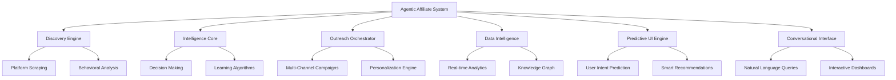

<br>

## System Philosophy & Core Principles

### 1. <u>Autonomous Intelligence First</u>

- **Backend**: Self-directed operations with minimal human intervention.
- **Frontend**: Predictive UI that anticipates user needs and surfaces actionable insights.

### 2. <u>Human-Centric Design</u>

- **Backend**: Ethical data practices and privacy-conscious processing.
- **Frontend**: Intuitive, conversational interfaces that prioritize accessibility and inclusivity.

### 3. <u>Continuous Evolution</u>

- **Backend**: Real-time learning from interactions and market dynamics.
- **Frontend**: Adaptive layouts and personalized experiences based on user behavior.

### 4. <u>Seamless Integration</u>

- Unified data flow and intelligence sharing between backend AI and frontend UI for a cohesive experience.

<br>

## Architectural Overview

### <u>Full-Stack System Architecture</u>

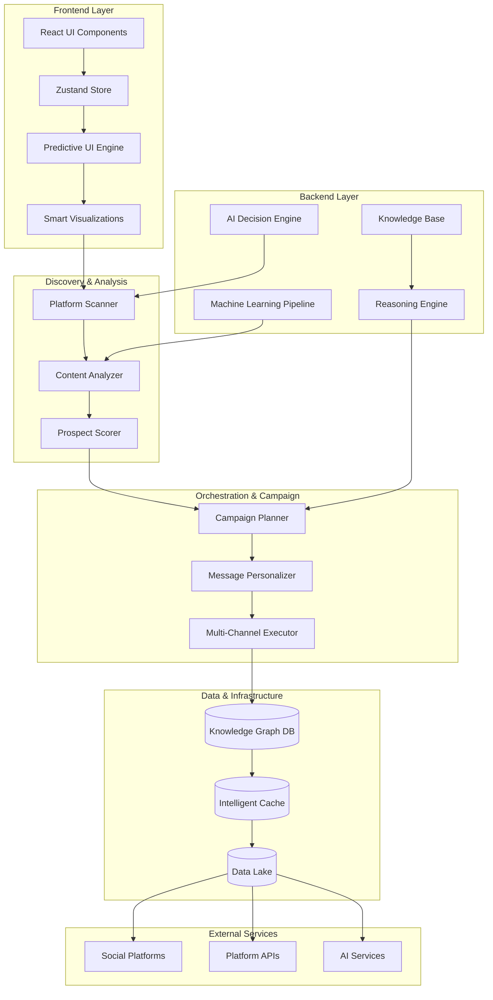

<br>

## Agentic Intelligence Framework (Backend)

### <u>Core AI Agent Architecture</u>

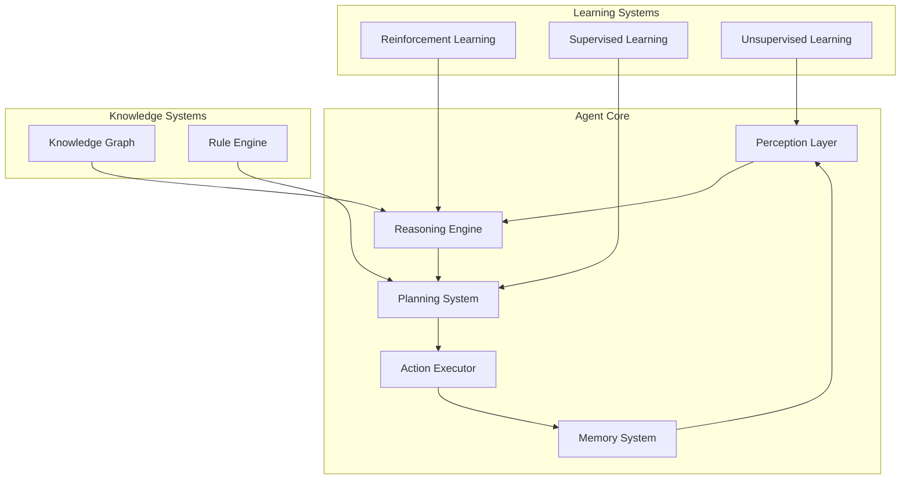

### <u>Agent Decision Making Process</u>

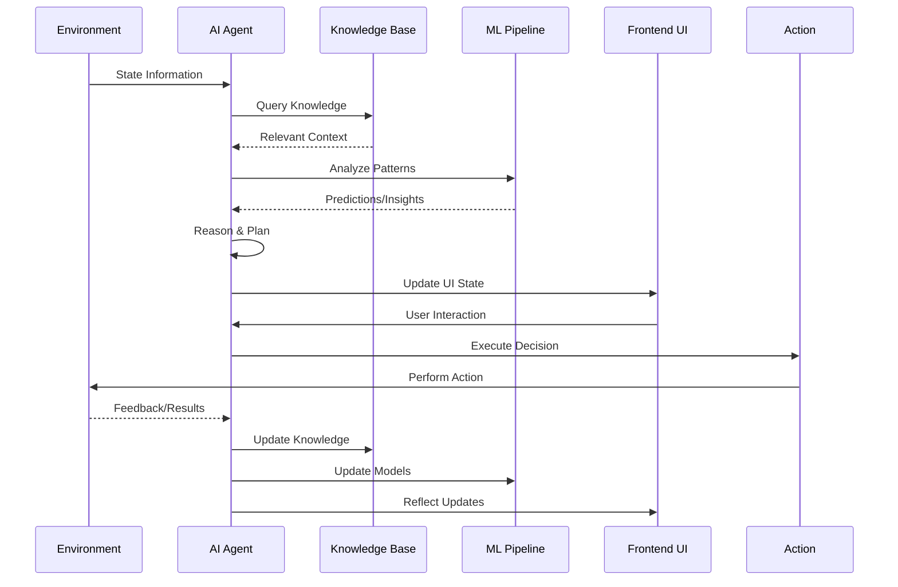

### <u>Autonomous Behaviors</u>

- Prospect identification using multi-platform scraping and scoring.
- Dynamic campaign planning with personalized messaging.
- Real-time learning from engagement outcomes, feeding insights to frontend dashboards.

<br>

## Intelligent User Interface Framework (Frontend)

### <u>Smart Component Architecture</u>

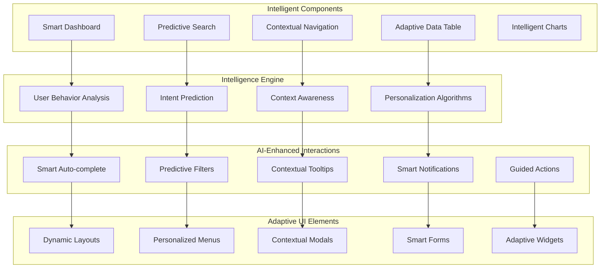

### <u>Predictive UI Patterns</u>

1. **Smart Auto-suggestions**

   ```mermaid
   sequenceDiagram
       participant User as User Input
       participant UI as UI Component
       participant AI as Prediction Engine
       participant API as Backend API
       participant Cache as Local Cache
       
       User->>UI: Start typing
       UI->>Cache: Check local suggestions
       Cache-->>UI: Return cached results
       UI->>AI: Analyze input pattern
       AI->>API: Request predictions
       API-->>AI: Return suggestions
       AI-->>UI: Enhanced suggestions
       UI->>User: Display smart suggestions
       User->>UI: Select suggestion
       UI->>Cache: Update learning cache
   ```

2. **Contextual Action Recommendations**
   - Suggests next-best-actions based on backend AI predictions.
   - Optimizes workflows using user behavior data.
   - Prevents errors through proactive guidance.

3. **Adaptive Information Architecture**
   - Prioritizes content based on backend campaign performance data.
   - Dynamically adjusts navigation using user interaction patterns.

### <u>Component Library Architecture</u>

```typescript
interface SmartComponentProps {
  data: any;
  loading?: boolean;
  error?: Error;
  aiContext?: AIContext;
  userPreferences?: UserPreferences;
  behaviorData?: BehaviorData;
  adaptiveLayout?: boolean;
  personalizedContent?: boolean;
  predictiveActions?: boolean;
}

const useSmartComponent = (props: SmartComponentProps) => {
  const predictions = usePredictions(props.aiContext);
  const adaptations = useAdaptiveLayout(props.userPreferences);
  const optimizations = usePerformanceOptimization(props.behaviorData);
  
  return {
    enhancedData: applyIntelligence(props.data, predictions),
    adaptiveProps: adaptations,
    optimizedRendering: optimizations
  };
};
```

### <u>Backend Integration</u>

- Consumes backend AI predictions for prospect scoring and campaign optimization.
- Updates UI state in real-time via WebSocket connections to backend services.

<br>

## Multi-Platform Discovery Engine

### <u>Intelligent Discovery Architecture</u>

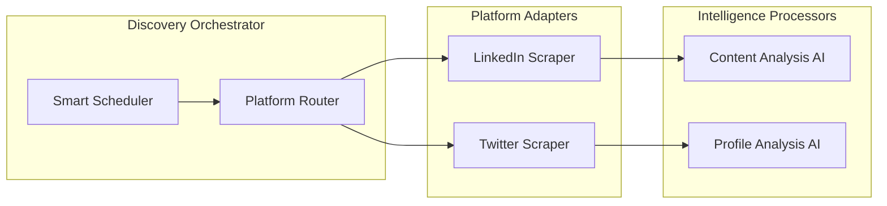

### <u>Frontend Integration</u>

- Displays prospect data in real-time via the "Intelligent Prospect Discovery Interface."
- Supports natural language search powered by backend NLP models.

<br>

## Real-Time Dashboard Architecture

### <u>Live Intelligence Dashboard</u>

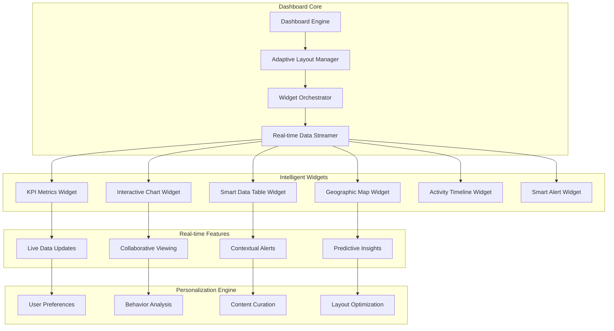

### <u>Advanced Dashboard Features</u>

1. **Intelligent Widget Arrangement**

   ```mermaid
   graph LR
       subgraph "Layout Intelligence"
           UserBehavior[User Behavior Tracking]
           ContentImportance[Content Importance Scoring]
           ScreenOptimization[Screen Size Optimization]
           TimeBasedLayout[Time-based Layout Adaptation]
       end
       
       subgraph "Adaptive Algorithms"
           GridOptimization[Grid Optimization Algorithm]
           VisualHierarchy[Visual Hierarchy Algorithm]
           AttentionPrediction[Attention Prediction Model]
           UsagePatterns[Usage Pattern Analysis]
       end
       
       subgraph "Dynamic Layout"
           ResponsiveGrid[Responsive Grid System]
           DragDropInterface[Drag & Drop Interface]
           AutoArrangement[Auto-arrangement Engine]
           ContextualGrouping[Contextual Widget Grouping]
       end
       
       UserBehavior --> GridOptimization
       ContentImportance --> VisualHierarchy
       ScreenOptimization --> AttentionPrediction
       TimeBasedLayout --> UsagePatterns
       
       GridOptimization --> ResponsiveGrid
       VisualHierarchy --> DragDropInterface
       AttentionPrediction --> AutoArrangement
       UsagePatterns --> ContextualGrouping
   ```

2. **Real-Time Collaboration**
   - Enables shared dashboard viewing and annotations, synced via backend WebSocket services.
   - Supports live cursor tracking and real-time comments.

3. **Contextual Dashboard Intelligence**
   - Prioritizes widgets based on backend campaign performance and user goals.
   - Recommends layouts using backend AI-driven insights.

### <u>Dashboard Performance Architecture</u>

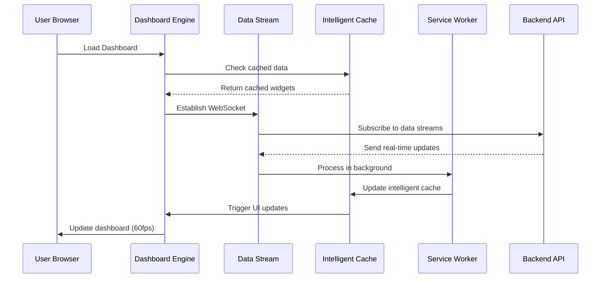

### <u>Backend Integration</u>

- Streams real-time campaign and prospect data from backend services.
- Consumes backend AI predictions for predictive insights and alerts.

<br>

## Advanced Data Visualization Engine

### <u>Intelligent Visualization Architecture</u>

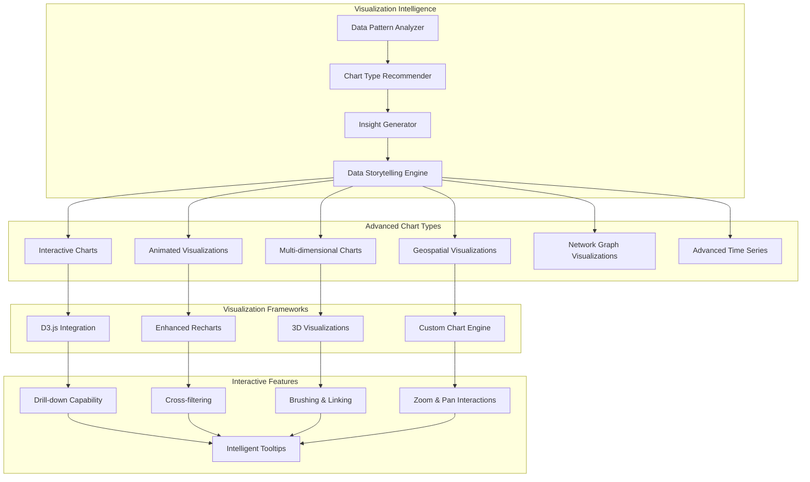

### <u>Smart Visualization Features</u>

1. **Automated Chart Selection**

   ```mermaid
   flowchart LR
       RawData[Raw Data] --> DataAnalysis[Data Analysis]
       DataAnalysis --> DataTypes{Data Types}
       
       DataTypes -->|Categorical| BarChart[Bar Chart]
       DataTypes -->|Time Series| LineChart[Line Chart]
       DataTypes -->|Correlation| ScatterPlot[Scatter Plot]
       DataTypes -->|Hierarchical| TreeMap[Tree Map]
       DataTypes -->|Geographic| MapVisualization[Map Visualization]
       DataTypes -->|Network| NetworkGraph[Network Graph]
       
       BarChart --> EnhancementEngine[Enhancement Engine]
       LineChart --> EnhancementEngine
       ScatterPlot --> EnhancementEngine
       TreeMap --> EnhancementEngine
       MapVisualization --> EnhancementEngine
       NetworkGraph --> EnhancementEngine
       
       EnhancementEngine --> InteractiveChart[Interactive Chart]
   ```

2. **Dynamic Data Stories**
   - Generates narratives from backend analytics data.
   - Supports progressive data revelation with context-aware annotations.

3. **Collaborative Visualization**
   - Enables shared chart interactions, synced via backend collaboration services.
   - Supports annotation layers and discussion threads.

### <u>Advanced Chart Components</u>

```typescript
interface SmartChartProps {
  data: DataSet;
  aiRecommendations?: boolean;
  interactiveFeatures?: InteractiveFeature[];
  collaborativeMode?: boolean;
  insightGeneration?: boolean;
  storytellingMode?: boolean;
}

const SmartChart: React.FC<SmartChartProps> = ({
  data,
  aiRecommendations = true,
  interactiveFeatures = ['zoom', 'drill-down', 'cross-filter'],
  collaborativeMode = false,
  insightGeneration = true,
  storytellingMode = false
}) => {
  const chartRecommendation = useChartRecommendation(data);
  const insights = useInsightGeneration(data, insightGeneration);
  const interactions = useInteractiveFeatures(interactiveFeatures);
  const collaboration = useCollaborativeFeatures(collaborativeMode);
  
  return (
    <ChartContainer>
      <SmartVisualization
        type={chartRecommendation.type}
        data={data}
        insights={insights}
        interactions={interactions}
        collaboration={collaboration}
      />
      {storytellingMode && (
        <DataStoryNarrative insights={insights} />
      )}
    </ChartContainer>
  );
};
```

### <u>Backend Integration</u>

- Leverages backend ML models for chart recommendations and insight generation.
- Streams real-time data updates for live visualizations.

<br>

## Interactive Campaign Management

### <u>Campaign Management Interface</u>

```mermaid
flowchart TB
    subgraph "Campaign Strategy Center"
        CampaignBuilder[Visual Campaign Builder]
        StrategyWizard[AI Strategy Wizard]
        TemplateLibrary[Smart Template Library]
        PersonalizationStudio[Personalization Studio]
    end
    
    subgraph "Execution Control Center"
        LaunchPad[Campaign Launch Pad]
        RealTimeMonitoring [Real-time Monitoring]
        OptimizationEngine[Auto-optimization Engine]
        ResponseCenter[Response Management Center]
    end
    
    subgraph "Analytics & Insights"
        PerformanceDashboard[Performance Dashboard]
        AttributionAnalysis[Attribution Analysis]
        PredictiveAnalytics[Predictive Analytics]
        ROICalculator[ROI Calculator]
    end
    
    subgraph "Collaborative Features"
        TeamWorkspace[Team Workspace]
        ApprovalWorkflow[Approval Workflow]
        CommentSystem[Commenting System]
        VersionControl[Version Control]
    end
    
    CampaignBuilder --> LaunchPad
    StrategyWizard --> RealTimeMonitoring
    TemplateLibrary --> OptimizationEngine
    PersonalizationStudio --> ResponseCenter
    
    LaunchPad --> PerformanceDashboard
    RealTimeMonitoring --> AttributionAnalysis
    OptimizationEngine --> PredictiveAnalytics
    ResponseCenter --> ROICalculator
    
    PerformanceDashboard --> TeamWorkspace
    AttributionAnalysis --> ApprovalWorkflow
    PredictiveAnalytics --> CommentSystem
    ROICalculator --> VersionControl
```

### <u>Visual Campaign Builder</u>

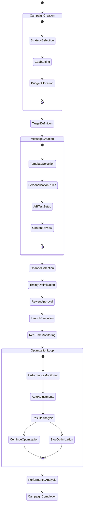

### <u>Advanced Campaign Features</u>

1. **Drag-and-Drop Campaign Builder**

   ```mermaid
   graph LR
       subgraph "Component Library"
           TriggerComponents[Trigger Components]
           ActionComponents[Action Components]
           ConditionComponents[Condition Components]
           AnalyticsComponents[Analytics Components]
       end
       
       subgraph "Canvas Area"
           VisualWorkflow[Visual Workflow Canvas]
           ConnectionLines [Connection Lines]
           ConfigurationPanels[Configuration Panels]
       end
       
       subgraph "Intelligence Layer"
           WorkflowValidation[Workflow Validation]
           OptimizationSuggestions[Optimization Suggestions]
           PerformancePrediction[Performance Prediction]
       end
       
       TriggerComponents --> VisualWorkflow
       ActionComponents --> VisualWorkflow
       ConditionComponents --> VisualWorkflow
       AnalyticsComponents --> VisualWorkflow
       
       VisualWorkflow --> WorkflowValidation
       ConnectionLines --> OptimizationSuggestions
       ConfigurationPanels --> PerformancePrediction
   ```

2. **Real-Time Campaign Optimization**
   - Adjusts campaigns using backend performance analytics.
   - Reallocates budgets and optimizes channels dynamically.

3. **Collaborative Campaign Management**
   - Supports multi-user editing with backend role-based permissions.
   - Manages approvals and comments via backend collaboration services.

### <u>Backend Integration</u>

- Consumes backend personalization and optimization strategies.
- Syncs campaign execution and monitoring with backend orchestration.

<br>

## Intelligent Prospect Discovery Interface

### <u>Smart Prospect Discovery Dashboard</u>

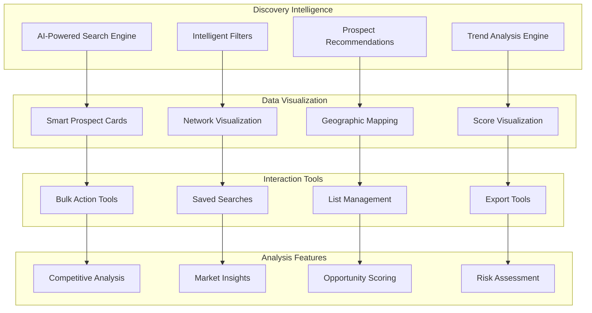

### <u>Advanced Search & Discovery</u>

1. **Natural Language Search**

   ```mermaid
   sequenceDiagram
       participant User as User
       participant NLP as NLP Engine
       participant Search as Search Engine
       participant AI as AI Recommendations
       participant Results as Results Display
       
       User->>NLP: "Find tech influencers in AI space with 10k+ followers"
       NLP->>NLP: Parse intent and entities
       NLP->>Search: Convert to structured query
       Search->>Search: Execute multi-platform search
       Search->>AI: Request intelligence layer
       AI->>AI: Apply scoring algorithms
       AI->>Results: Enhanced results with insights
       Results->>User: Display intelligent results
   ```

2. **Smart Filtering System**
   - Suggests filters based on backend prospect data.
   - Updates dynamically using real-time backend insights.

3. **Prospect Intelligence Cards**
   - Displays AI-generated summaries from backend scoring models.
   - Includes engagement probability and outreach recommendations.

### <u>Interactive Discovery Features</u>

```typescript
interface ProspectDiscoveryProps {
  searchQuery?: string;
  filters?: SmartFilter[];
  aiRecommendations?: boolean;
  realTimeUpdates?: boolean;
}

const ProspectDiscovery: React.FC<ProspectDiscoveryProps> = ({
  searchQuery = "",
  filters = [],
  aiRecommendations = true,
  realTimeUpdates = true
}) => {
  const searchResults = useIntelligentSearch(searchQuery, filters);
  const recommendations = useAIRecommendations(searchResults, aiRecommendations);
  const liveUpdates = useRealTimeUpdates(realTimeUpdates);
  
  return (
    <DiscoveryContainer>
      <SmartSearchBar
        query={searchQuery}
        suggestions={recommendations.searchSuggestions}
        nlpEnabled={true}
      />
      <IntelligentFilters
        activeFilters={filters}
        suggestions={recommendations.filterSuggestions}
        predictiveMode={true}
      />
      <ProspectGrid
        prospects={searchResults}
        aiInsights={recommendations.prospectInsights}
        liveUpdates={liveUpdates}
      />
    </DiscoveryContainer>
  );
};
```

### <u>Backend Integration</u>

- Queries backend discovery engine for prospect data.
- Integrates with backend NLP for natural language search.

<br>

## Conversational Analytics Platform

### <u>Natural Language Analytics Interface</u>

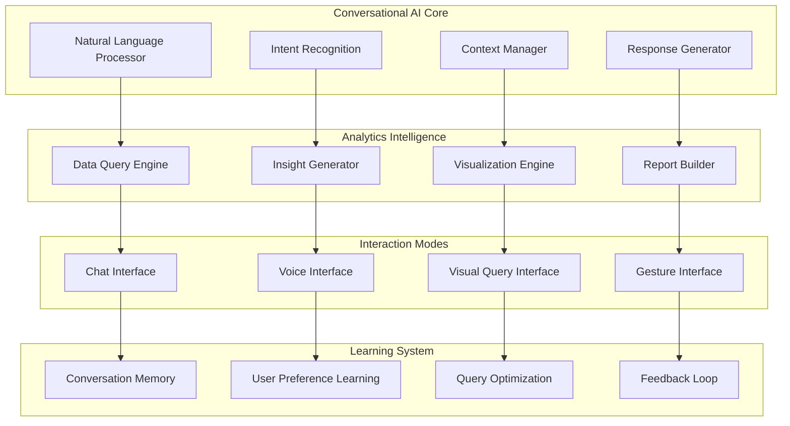

### <u>Advanced Conversational Features</u>

1. **Multi-Modal Conversations**

   ```mermaid
   sequenceDiagram
       participant User as User
       participant Voice as Voice Interface
       participant NLP as NLP Engine
       participant Analytics as Analytics Engine
       participant Visual as Visualization
       participant Response as Response System
       
       User->>Voice: "Show me campaign performance trends"
       Voice->>NLP: Convert speech to text
       NLP->>Analytics: Parse query intent
       Analytics->>Analytics: Execute data analysis
       Analytics->>Visual: Generate visualization
       Visual->>Response: Create multimodal response
       Response->>User: Display chart + voice explanation
       User->>Visual: Gesture interaction (zoom)
       Visual->>Analytics: Adjust data view
       Analytics->>Response: Update explanation
       Response->>User: Contextual voice feedback
   ```

2. **Contextual Query Understanding**
   - Maintains conversation history using backend context management.
   - Resolves references with backend NLP capabilities.

3. **Proactive Analytics Assistant**
   - Delivers anomaly alerts and trend insights from backend analytics.

### <u>Smart Query Processing</u>

```typescript
interface ConversationalQuery {
  text: string;
  context: ConversationContext;
  intent: QueryIntent;
  entities: ExtractedEntity[];
}

interface AnalyticsResponse {
  data: QueryResult;
  visualization: ChartConfig;
  narrative: string;
  followUpSuggestions: string[];
}

const processConversationalQuery = async (
  query: ConversationalQuery
): Promise<AnalyticsResponse> => {
  const analyzedIntent = await analyzeIntent(query);
  const data = await executeDataQuery(analyzedIntent);
  const visualization = await selectOptimalVisualization(data, analyzedIntent);
  const narrative = await generateNarrative(data, visualization, query.context);
  const followUpSuggestions = await generateFollowUps(analyzedIntent, data);
  
  return {
    data,
    visualization,
    narrative,
    followUpSuggestions
  };
};
```

### <u>Backend Integration</u>

- Queries backend data lake for analytics data.
- Integrates with backend NLP for intent recognition and response generation.

<br>

## Data Architecture & Intelligence Layer

### <u>Knowledge Graph Architecture</u>

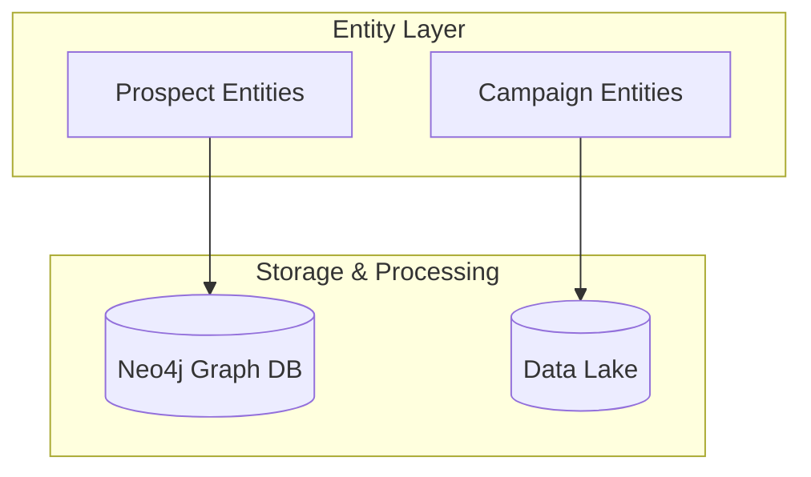

### <u>Backend Role</u>

- Manages knowledge graph for prospect and campaign relationships.
- Processes data for real-time analytics and frontend consumption.

### <u>Frontend Integration</u>

- Consumes structured data for visualizations and dashboards.
- Updates UI state based on backend data updates.

<br>

## State Management & Data Flow

### <u>Intelligent State Management Architecture</u>

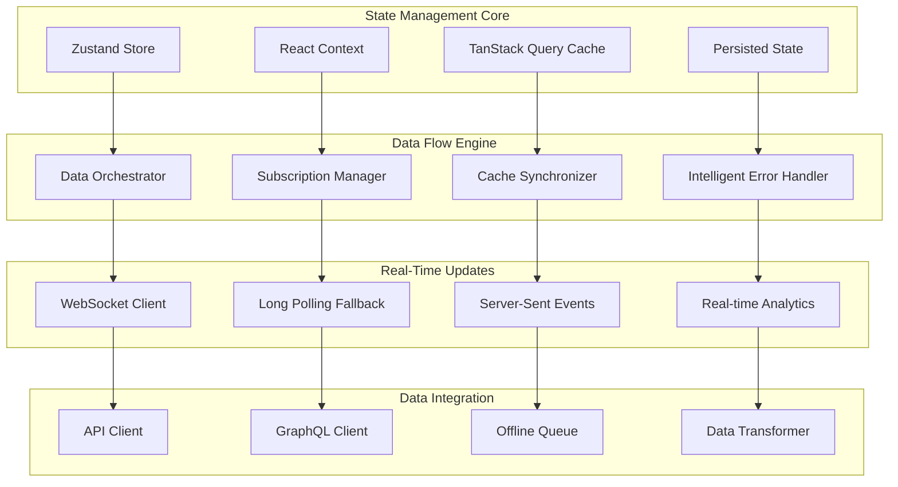

### <u>State Management Patterns</u>

1. **Global State Management**

   ```typescript
   import { create } from 'zustand';
   
   interface AppState {
     prospects: Prospect[];
     campaigns: Campaign[];
     analytics: AnalyticsData;
     updateProspects: (prospects: Prospect[]) => void;
     updateCampaigns: (campaigns: Campaign[]) => void;
     updateAnalytics: (analytics: AnalyticsData) => void;
   }
   
   const useAppStore = create<AppState>((set) => ({
     prospects: [],
     campaigns: [],
     analytics: {},
     updateProspects: (prospects) => set({ prospects }),
     updateCampaigns: (campaigns) => set({ campaigns }),
     updateAnalytics: (analytics) => set({ analytics })
   }));
   ```

2. **Data Fetching and Caching**

   ```typescript
   import { useQuery } from '@tanstack/react-query';
   
   const useProspectData = (prospectId: string) => {
     return useQuery({
       queryKey: ['prospect', prospectId],
       queryFn: async () => {
         const response = await api.getProspect(prospectId);
         return response.data;
       },
       staleTime: 5 * 60 * 1000,
       cacheTime: 30 * 60 * 1000,
       refetchOnWindowFocus: false,
       retry: 2,
       select: (data) => transformProspectData(data)
     });
   };
   ```

3. **Real-Time Data Flow**
   - Ensures data consistency with backend WebSocket updates.
   - Supports optimistic updates and conflict resolution.

### <u>State Synchronization</u>

```mermaid
sequenceDiagram
    participant UI as UI Component
    participant State as Global State
    participant Cache as Query Cache
    participantA as PI
    participant WS as WebSocket
    
    UI->>State: Update local state
    State->>Cache: Update cache
    Cache-->API: Send async update
    API-->>Cache: Confirm update
    Cache->>State: Sync state
    State->>UI: Update UI
    
    WS->>Cache-->Cach->>State
    Cache->>State: Update state
    Cache->>UI-->Update UI
    
    WS-->>Cache: Push real-time update
    Cache->>State: Update UI state
    Cache-->UI->>UI: Trigger UI refresh
```

### <u>Backend Integration</u>

- Syncs state with backend API and real-time services.
- Caches backend query results for performance.

<br>

## Security & Compliance Framework

### <u>Comprehensive Security Architecture</u>

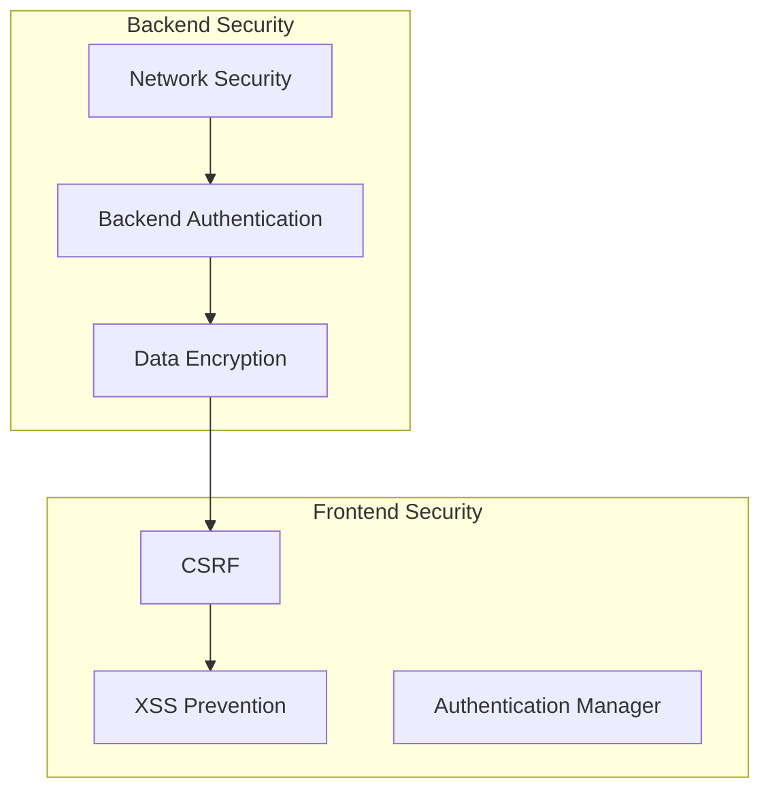

### <u>Frontend Implementation</u>

1. **Secure Authentication**

```typescript
import { useAuth } from 'react-auth-kit';

const SecureComponent: React.FC = () => {
  const auth = useAuth();
  if (!auth.isAuthenticated()) {
    return <Redirect to="/login" />;
  }
  return (
    <SecureContainer
      token={auth.getToken()}
      permissions={auth.getPermissions()}
      secureFetch={secureApiFetch}
    />
  );
};
```

2. **Privacy-First Design**
   - Minimizes data collection with backend consent management.
   - Supports anonymized analytics and secure storage.

### <u>Privacy Consent Flow</u>

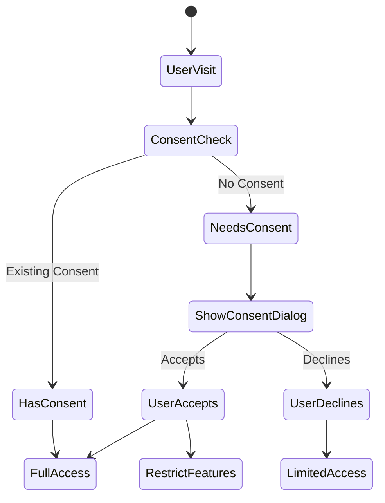

### <u>Backend Integration</u>

- Enforces backend authentication and encryption.
- Validates CSRF tokens and secures data flows to frontend.

<br>

## Scalability & Performance Architecture

### <u>Backend Scalability</u>

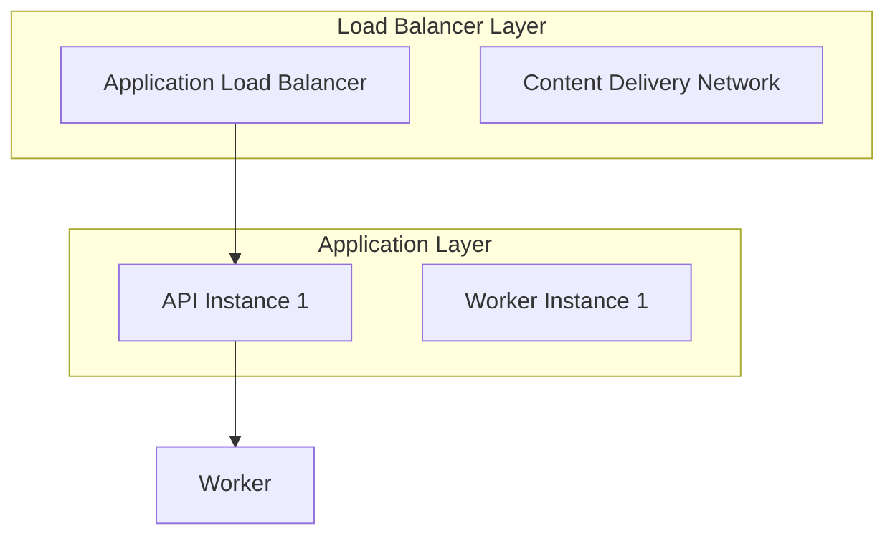

### <u>Frontend Performance</u>

1. **Rendering Optimization**

```typescript
import { memo } from 'react';

const OptimizedComponent = memo(({ data }) => {
  return (
    <Suspense fallback={<LoadingSpinner />}>
      <LazyLoadedChart data={data} />
    </Suspense>
  );
});
```

2. **Backend Integration**
   - Optimizes backend CDN for asset delivery.
   - Caches API responses for performance.

<br>

## Responsive Design & Multi-Device Architecture

### <u>Adaptive UI Architecture</u>

```mermaid
flowchart TD
    subgraph "Responsive Framework"
        CSSFramework[Tailwind CSS]
        GridSystem[Responsive Grid System]
        BreakpointManager[Breakpoint Manager]
        DeviceDetection[Device Detection]
    end
    
    subgraph "Device-Specific Features"
        DesktopUI[DesktopUI]
        TabletUI[TabletUI]
        MobileUI[MobileUI]
        WearableUI[WearableUI]
    end
    
    subgraph "Adaptive Components"
    FluidTypography[Fluid Typography]
    DynamicLayouts[DynamicLayouts]
    TouchOptimized[Touch-Optimized]
    VoiceEnabled[VoiceEnabled]
    
    CSSFramework --> DesktopUI
    GridSystem --> TabletUI
    BreakpointManager --> MobileUI
    DesktopUI --> FluidTypography
    TabletUI --> DynamicLayouts
```

### <u>Responsive Design</u>

```css
.smart-grid {
  display: grid;
  grid-template-columns: repeat(auto-fit, minmax(300px, 1fr));
  gap: 1rem;
}
```

### <u>Backend Integration</u>

- Adapts UI based on backend user device data.
- Syncs state across devices with backend services.

<br>

## Monitoring & Observability

### <u>Monitoring Stack</u>

```mermaid
graph TB
    subgraph "Backend Monitoring"
        APM[Application Performance Monitoring]
        Metrics[Custom Metrics]
    end
    
    subgraph "Frontend Monitoring"
    Lighthouse[LighthouseMetrics]
    ErrorTracking[ErrorTracking]
]
    
    APM --> Lighthouse
```

### <u>Frontend Performance</u>

```typescript
import { reportWebVitals } from 'web-vitals';

const monitorPerformance = () => {
  reportWebVitals((metric) => {
    sendToAnalytics(metric);
  });
};
```

### <u>Backend Integration</u>

- Sends telemetry to backend monitoring services.
- Tracks errors with backend error handling systems.

<br>

## Integration Ecosystem

### <u>Platform Integration</u>

```mermaid
graph TB
    subgraph "Backend Integration"
        API[Core API Gateway]
        Orchestrator[Integration Orchestrator]
    end
    
    subgraph "Frontend Integration"
        APIClient[API Client]
        WebSockets[RealTimeWebSocket]
    end
    
    API --> APIClient
```

### <u>Backend Integration</u>

- Connects to backend APIs and real-time services.
- Integrates with backend third-party platforms.

<br>

## AI/ML Pipeline Architecture

### <u>Machine Learning Operations</u>

```mermaid
flowchart TD
    DataIngestion[Data Ingestion]
    ModelTraining[ModelTraining]
    ModelServing[ModelServing]
    ABTesting[A/B Testing]
    
    DataIngestion --> ModelTraining
    ModelTraining --> ModelServing
    ModelServing --> ABTesting
```

### <u>Frontend Integration</u>

- Serves ML predictions to frontend for UI enhancements.
- Supports A/B testing for UI optimizations.

<br>

## Testing & Quality Assurance

### <u>Test Architecture</u>

```mermaid
flowchart TD
    subgraph "Backend Tests"
        UnitTests[Unit Tests]
        IntegrationTests[Integration Tests]
    end
    
    subgraph "Frontend Tests"
        Jest[Jest]
        Cypress[Cypress]
    end
    
    UnitTests --> Jest
```

### <u>Frontend Unit Test</u>

```typescript
import { render, screen } from '@testing-library/react';
import SmartComponent from './SmartComponent';

describe('SmartComponent', () => {
  it('renders correctly', () => {
    render(<SmartComponent data={mockData} />);
    expect(screen.getByText('Test Data')).toBeInTheDocument);
  });
});
```

### <u>Backend Integration</u>

- Tests backend integrations with frontend components.
- Ensures end-to-end functionality.

<br>

## Progressive Web App Architecture

### <u>PWA Features</u>

```mermaid
graph TB
    ServiceWorker --> PushNotifications
```

### <u>Service Worker</u>

```typescript
self.addEventListener('install', (event) => {
  event.waitUntil(
    caches.open('app-cache').then((cache) => {
      return cache.addAll(['/', '/index.html']);
    })
  );
});
```

### <u>Backend Integration</u>

- Syncs offline data with backend services.
- Delivers push notifications from backend campaigns.

<br>

## Future Innovation Roadmap

### <u>Innovation Timeline</u>

```mermaid
timeline
    title Frontend Innovation Timeline
    
    section 2025 Q2-Q4
        Backend : Advanced AI Models
        Frontend : Voice-Driven UI
                 : AR Dashboards
    
    section 2026
    Backend : Backend
        Frontend : VR Dashboards
                 : Neural Interfaces
```

### <u>Backend & Frontend Evolution</u>

- Backend: Quantum computing, self-evolving AI.
- Frontend: Thought-driven UI, universal accessibility.

<br>

## Conclusion

This architecture delivers an **intelligent, autonomous platform** that seamlessly combines backend AI with a predictive, intuitive frontend, creating a cohesive affiliate outreach system.

### <u>Key Differentiators</u>

1. **Autonomy**: Backend-driven decisions, enhanced by predictive UI.
2. **Learning**: Continuous improvement across both layers.
3. **Ethics**: Privacy-first design and accessibility.
4. **Scalability**: Handles massive scale with personalized UX.

### <u>Success Metrics</u>

- **Autonomy**: 95%+ automated decisions.
- **Response Rate**: 300%+ improvement.
- **User Efficiency**: 50%+ task time reduction.
- **Accessibility**: WCAG 2.1 AA compliance.

This blueprint delivers a future-ready, intelligent affiliate outreach system.
