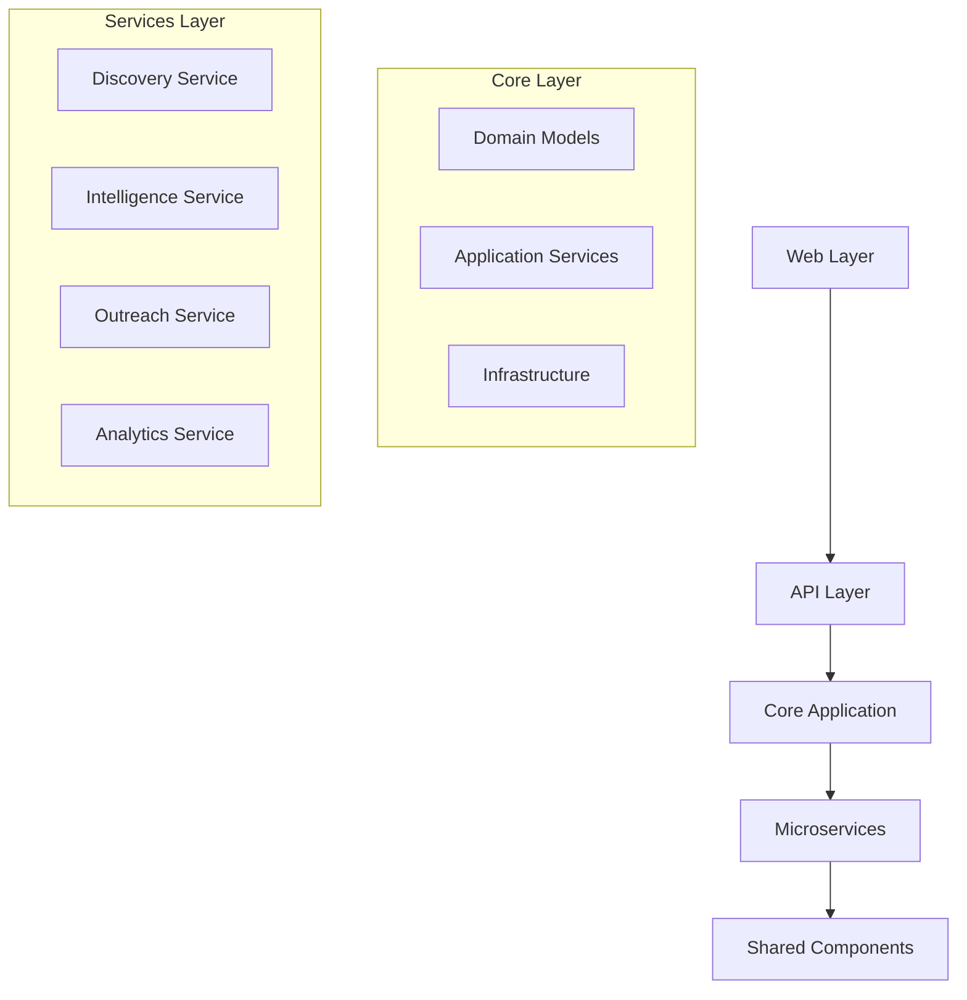

# Source Code Directory

This directory contains the core source code for the Agentic Affiliate Outreach System, organized according to **Clean Architecture** principles and **Domain-Driven Design** patterns.

## 🏗️ Architecture Overview

The source code follows a layered architecture with clear separation of concerns:

```
src/
├── core/                 # Core business logic and domain models
├── services/             # Autonomous microservices
├── shared/               # Shared components and utilities
├── api/                  # RESTful API layer
└── web/                  # Web interfaces and frontend
```

## 📁 Directory Structure

### `/core` - Core Business Logic

Contains the fundamental business logic, domain models, and application services that implement the core business rules of the affiliate outreach system.

- **Domain Layer**: Pure business logic and domain models
- **Application Layer**: Use cases, application services, and business workflows
- **Infrastructure Layer**: Database, configuration, and external service integrations

### `/services` - Microservices

Independent, autonomous services that handle specific business capabilities:

- **Discovery Service**: Multi-platform prospect discovery and analysis
- **Intelligence Service**: AI agent for autonomous decision-making
- **Outreach Service**: Campaign orchestration and message delivery
- **Analytics Service**: Performance tracking and business intelligence

### `/shared` - Shared Components

Common utilities, models, and components used across multiple services:

- **Models**: Shared data models and event definitions
- **Utilities**: Common helper functions and base classes
- **Exceptions**: Custom exception classes

### `/api` - API Layer

RESTful API implementation using FastAPI:

- **Endpoints**: API endpoint implementations
- **Routers**: Route definitions and organization
- **Schemas**: Request/response validation models
- **Middleware**: Cross-cutting concerns (auth, logging, metrics)

### `/web` - Web Interfaces

Frontend applications and web interfaces:

- **Frontend**: React-based web application
- **Admin**: Administrative interfaces
- **Public**: Public-facing web pages

## 🔄 Data Flow



## 🎯 Design Principles

### 1. **Separation of Concerns**

Each layer has a specific responsibility and doesn't depend on implementation details of other layers.

### 2. **Dependency Inversion**

High-level modules don't depend on low-level modules. Both depend on abstractions.

### 3. **Single Responsibility**

Each module, class, and function has a single, well-defined responsibility.

### 4. **Open/Closed Principle**

Software entities are open for extension but closed for modification.

### 5. **Interface Segregation**

Clients shouldn't be forced to depend on interfaces they don't use.

## 🚀 Getting Started

### Development Setup

1. **Install Dependencies**

   ```bash
   pip install -r requirements.txt
   ```

2. **Set Environment Variables**

   ```bash
   export PYTHONPATH="${PYTHONPATH}:$(pwd)/src"
   ```

3. **Run Tests**

   ```bash
   pytest src/ -v
   ```

### Code Organization Guidelines

1. **Import Structure**

   ```python
   # Standard library imports
   import os
   from typing import List, Dict
   
   # Third-party imports
   from fastapi import FastAPI
   from sqlalchemy import Column
   
   # Local imports
   from src.core.domain.models import Prospect
   from src.shared.utils import logger
   ```

2. **Module Structure**

   ```python
   """
   Module docstring explaining purpose and usage.
   """
   
   # Type definitions
   # Constants
   # Classes
   # Functions
   ```

3. **Naming Conventions**
   - **Classes**: PascalCase (`ProspectService`)
   - **Functions/Variables**: snake_case (`get_prospects`)
   - **Constants**: UPPER_SNAKE_CASE (`MAX_RETRIES`)
   - **Files/Modules**: snake_case (`prospect_service.py`)

## 🧪 Testing Strategy

### Test Organization

```
tests/
├── unit/           # Unit tests for individual components
├── integration/    # Integration tests for service interactions
├── e2e/           # End-to-end tests for complete workflows
└── fixtures/      # Test data and fixtures
```

### Testing Guidelines

1. **Unit Tests**: Test individual functions and classes in isolation
2. **Integration Tests**: Test interactions between components
3. **End-to-End Tests**: Test complete user workflows
4. **Mocking**: Use mocks for external dependencies

## 📊 Monitoring & Observability

### Logging

```python
from src.shared.utils.logger import get_logger

logger = get_logger(__name__)
logger.info("Processing prospect", extra={"prospect_id": prospect.id})
```

### Metrics

```python
from src.shared.utils.metrics import counter, histogram

counter("prospects.discovered").inc()
histogram("api.request.duration").observe(duration)
```

### Tracing

```python
from src.shared.utils.tracing import trace

@trace("prospect.discovery")
def discover_prospects(criteria: DiscoveryCriteria) -> List[Prospect]:
    # Implementation
    pass
```

## 🔧 Development Tools

### Code Quality

```bash
# Format code
black src/

# Lint code
flake8 src/

# Type checking
mypy src/

# Security scanning
bandit -r src/
```

### Documentation

```bash
# Generate API docs
python -m src.api.main --docs

# Generate code docs
sphinx-build -b html docs/ docs/_build/
```

## 🤝 Contributing

1. Follow the established architecture patterns
2. Write comprehensive tests for new code
3. Update documentation for new features
4. Follow code style guidelines
5. Use type hints for all functions

## 📚 Additional Resources

- [Clean Architecture](https://blog.cleancoder.com/uncle-bob/2012/08/13/the-clean-architecture.html)
- [Domain-Driven Design](https://martinfowler.com/bliki/DomainDrivenDesign.html)
- [FastAPI Documentation](https://fastapi.tiangolo.com/)
- [Python Type Hints](https://docs.python.org/3/library/typing.html)
