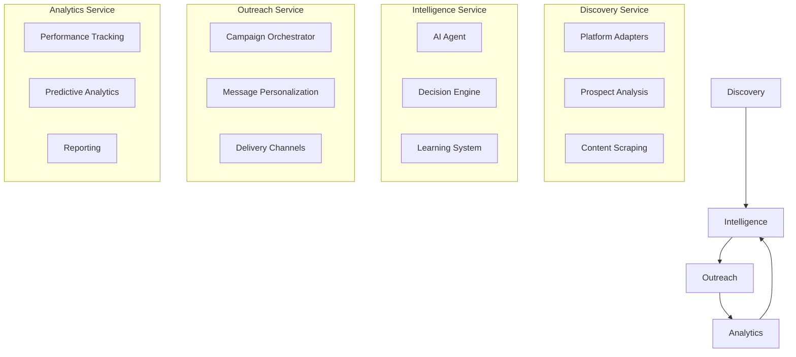

# Microservices

This directory contains the autonomous microservices that implement the core business capabilities of the Agentic Affiliate Outreach System. Each service is designed to be independently deployable and scalable.

## 🏗️ Architecture Overview

The microservices architecture follows **Domain-Driven Design** principles with clear service boundaries:

```
services/
├── discovery/            # Multi-Platform Discovery Engine
├── intelligence/         # Agentic Intelligence Framework
├── outreach/            # Dynamic Outreach Orchestration
└── analytics/           # Analytics and Intelligence Service
```

## 🎯 Service Boundaries

Each service owns its domain and data, communicating through well-defined APIs and events:



## 📁 Service Descriptions

### 🔍 Discovery Service

**Purpose**: Autonomous discovery and analysis of affiliate prospects across multiple platforms

**Key Capabilities**:

- Multi-platform scraping (LinkedIn, Twitter, YouTube, TikTok, Instagram, Reddit)
- Intelligent prospect scoring and ranking
- Content analysis and trend detection
- Competitive intelligence gathering
- Real-time prospect monitoring

**Technologies**:

- Platform APIs and web scraping
- NLP for content analysis
- Computer vision for profile analysis
- Machine learning for scoring

### 🧠 Intelligence Service

**Purpose**: Autonomous AI agent that makes intelligent decisions about outreach strategies

**Key Capabilities**:

- Autonomous decision-making with LangChain
- Strategy optimization and planning
- Learning from campaign outcomes
- Predictive modeling for success rates
- Context-aware reasoning

**Technologies**:

- OpenAI GPT-4+ for reasoning
- LangChain for AI orchestration
- Reinforcement learning for optimization
- Vector databases for knowledge storage

### 📧 Outreach Service

**Purpose**: Orchestrates personalized outreach campaigns across multiple channels

**Key Capabilities**:

- AI-powered message personalization
- Multi-channel campaign management
- Optimal timing calculation
- Conversation flow automation
- A/B testing and optimization

**Technologies**:

- Email service providers (SendGrid, Mailgun)
- Social media APIs (LinkedIn, Twitter)
- Message queuing for delivery
- Template engines for personalization

### 📊 Analytics Service

**Purpose**: Comprehensive analytics, reporting, and business intelligence

**Key Capabilities**:

- Real-time performance tracking
- Predictive analytics and forecasting
- Campaign effectiveness analysis
- ROI calculation and optimization
- Interactive dashboards and reporting

**Technologies**:

- Time-series databases for metrics
- Data visualization libraries
- Machine learning for predictions
- Real-time streaming analytics

## 🔄 Inter-Service Communication

### Event-Driven Communication

Services communicate primarily through events to maintain loose coupling:

```python
# Example: Discovery service publishes prospect discovered event
from src.shared.models.events import ProspectDiscoveredEvent

event = ProspectDiscoveredEvent(
    prospect_id="123",
    platform="linkedin",
    profile_data=profile_data,
    initial_score=85.5
)
await event_bus.publish(event)
```

### API Communication

For synchronous operations, services expose RESTful APIs:

```python
# Example: Intelligence service API call
from src.services.intelligence.client import IntelligenceClient

client = IntelligenceClient()
decision = await client.make_decision(
    objective="optimize_outreach_strategy",
    context=campaign_context
)
```

### Message Queues

For reliable async processing:

```python
# Example: Queue-based task processing
from src.services.outreach.tasks import send_personalized_message

await send_personalized_message.delay(
    prospect_id="123",
    campaign_id="456",
    template_id="789"
)
```

## 🚀 Service Development

### Service Structure

Each service follows a consistent structure:

```
service_name/
├── __init__.py           # Service initialization
├── api/                  # Service API endpoints
├── domain/               # Service domain models
├── handlers/             # Event handlers
├── tasks/                # Background tasks
├── clients/              # External service clients
├── config/               # Service configuration
└── tests/                # Service tests
```

### Creating a New Service

1. **Define Service Boundary**

   ```python
   # Define what the service is responsible for
   class ServiceDomain:
       """
       Clear definition of service responsibilities
       and boundaries
       """
       pass
   ```

2. **Implement Domain Models**

   ```python
   # Service-specific domain models
   from dataclasses import dataclass
   
   @dataclass
   class ServiceEntity:
       id: str
       # Service-specific attributes
   ```

3. **Create API Endpoints**

   ```python
   # FastAPI router for service
   from fastapi import APIRouter
   
   router = APIRouter(prefix="/api/v1/service")
   
   @router.get("/endpoint")
   async def service_endpoint():
       return {"status": "ok"}
   ```

4. **Add Event Handlers**

   ```python
   # Handle events from other services
   @event_handler(SomeEvent)
   async def handle_event(event: SomeEvent):
       # Process event
       pass
   ```

## 🧪 Testing Strategy

### Service Testing Pyramid

```
    E2E Tests (Few)
   ┌─────────────────┐
  │  Integration     │
 │    Tests          │
│   (Some)           │
└─────────────────────┘
│                     │
│    Unit Tests       │
│     (Many)          │
└─────────────────────┘
```

### Unit Tests

Test individual service components in isolation:

```python
def test_prospect_scoring():
    scorer = ProspectScorer()
    score = scorer.calculate_score(prospect_data)
    assert 0 <= score <= 100
```

### Integration Tests

Test service interactions:

```python
async def test_service_integration():
    # Test actual service communication
    result = await discovery_service.discover_prospects(criteria)
    assert len(result) > 0
```

### End-to-End Tests

Test complete workflows across services:

```python
async def test_complete_outreach_workflow():
    # Test full prospect discovery -> outreach -> analytics flow
    pass
```

## 📊 Service Monitoring

### Health Checks

Each service exposes health check endpoints:

```python
@router.get("/health")
async def health_check():
    return {
        "status": "healthy",
        "timestamp": datetime.now(),
        "version": "1.0.0",
        "dependencies": await check_dependencies()
    }
```

### Metrics Collection

Services emit metrics for monitoring:

```python
from src.shared.utils.metrics import counter, histogram

# Track service operations
counter("service.operations.total").inc()
histogram("service.operation.duration").observe(duration)
```

### Distributed Tracing

Track requests across services:

```python
from src.shared.utils.tracing import trace

@trace("service.operation")
async def service_operation():
    # Operation implementation
    pass
```

## 🔧 Service Configuration

### Environment-Based Configuration

```python
from src.services.discovery.config import DiscoveryConfig

config = DiscoveryConfig()
api_key = config.PLATFORM_API_KEY
rate_limit = config.RATE_LIMIT_PER_MINUTE
```

### Feature Flags

```python
from src.shared.utils.feature_flags import is_enabled

if is_enabled("new_scoring_algorithm"):
    # Use new algorithm
    pass
else:
    # Use existing algorithm
    pass
```

## 🚀 Deployment

### Independent Deployment

Each service can be deployed independently:

```bash
# Deploy specific service
kubectl apply -f deployment/k8s/discovery-service.yaml

# Scale specific service
kubectl scale deployment discovery-service --replicas=3
```

### Service Discovery

Services register themselves for discovery:

```python
from src.shared.utils.service_registry import register_service

await register_service(
    name="discovery-service",
    host="discovery-service.default.svc.cluster.local",
    port=8000,
    health_check="/health"
)
```

## 🛡️ Security

### Service-to-Service Authentication

```python
from src.shared.utils.auth import ServiceAuth

auth = ServiceAuth()
token = await auth.get_service_token("intelligence-service")
```

### API Security

```python
from src.shared.middleware.auth import require_service_auth

@router.get("/protected")
@require_service_auth
async def protected_endpoint():
    return {"data": "sensitive"}
```

## 🤝 Contributing

### Service Development Guidelines

1. **Single Responsibility**: Each service should have one clear purpose
2. **Loose Coupling**: Minimize dependencies between services
3. **High Cohesion**: Related functionality should be in the same service
4. **API Versioning**: Use versioned APIs for backward compatibility
5. **Event Design**: Design events for extensibility

### Code Quality Standards

1. **Type Hints**: Use type hints for all function signatures
2. **Documentation**: Document all public APIs
3. **Testing**: Maintain high test coverage
4. **Error Handling**: Implement comprehensive error handling
5. **Logging**: Add structured logging for observability

## 📚 Additional Resources

- [Microservices Patterns by Chris Richardson](https://microservices.io/)
- [Building Microservices by Sam Newman](https://samnewman.io/books/building_microservices/)
- [Domain-Driven Design by Eric Evans](https://martinfowler.com/bliki/DomainDrivenDesign.html)
- [Event-Driven Architecture](https://martinfowler.com/articles/201701-event-driven.html)
