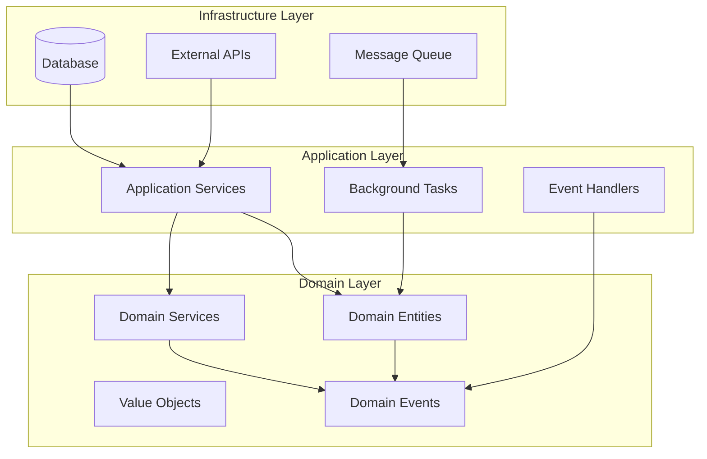

# Core Business Logic

This directory contains the core business logic and domain models of the Agentic Affiliate Outreach System, implementing **Clean Architecture** and **Domain-Driven Design** principles.

## 🏗️ Architecture Overview

The core layer is organized into three main sublayers following Clean Architecture:

```
core/
├── domain/               # Domain models and business rules
├── application/          # Application services and use cases
└── infrastructure/       # Infrastructure concerns
```

## 📁 Directory Structure

### `/domain` - Domain Layer

The innermost layer containing pure business logic and domain models:

- **Entities**: Core business objects with identity
- **Value Objects**: Immutable objects that describe aspects of the domain
- **Domain Services**: Business logic that doesn't naturally fit within entities
- **Repositories**: Interfaces for data access (implementations in infrastructure)
- **Events**: Domain events that represent business occurrences

### `/application` - Application Layer

Orchestrates domain objects to perform application-specific tasks:

- **Services**: Application services that coordinate domain objects
- **Use Cases**: Specific business use cases and workflows
- **Tasks**: Background tasks and job processing (Celery)
- **Handlers**: Event handlers and command handlers
- **DTOs**: Data Transfer Objects for application boundaries

### `/infrastructure` - Infrastructure Layer

Handles external concerns and technical implementation details:

- **Database**: Database models, repositories, and data access
- **Config**: Configuration management and settings
- **External Services**: Third-party service integrations
- **Persistence**: Data persistence implementations

## 🎯 Design Principles

### 1. **Dependency Rule**

Dependencies point inward. The domain layer has no dependencies on outer layers.

```
Infrastructure → Application → Domain
```

### 2. **Pure Business Logic**

The domain layer contains only business rules and is framework-agnostic.

### 3. **Separation of Concerns**

Each layer has distinct responsibilities:

- **Domain**: What the business does
- **Application**: How the business does it
- **Infrastructure**: Technical implementation details

## 🔄 Data Flow



## 🚀 Key Components

### Domain Entities

```python
# Example: Prospect entity
from src.core.domain.entities.prospect import Prospect
from src.core.domain.value_objects.contact_info import ContactInfo

prospect = Prospect(
    name="John Doe",
    platform="linkedin",
    contact_info=ContactInfo(email="john@example.com"),
    score=85.5
)
```

### Application Services

```python
# Example: Prospect discovery service
from src.core.application.services.prospect_service import ProspectService

service = ProspectService()
prospects = await service.discover_prospects(
    criteria=DiscoveryCriteria(platform="linkedin", industry="tech")
)
```

### Background Tasks

```python
# Example: Celery task
from src.core.application.tasks.prospect_tasks import score_prospect

# Async task execution
score_prospect.delay(prospect_id="123")
```

## 🧪 Testing Strategy

### Domain Testing

```python
# Test domain logic in isolation
def test_prospect_scoring():
    prospect = Prospect(name="Test", platform="linkedin")
    score = prospect.calculate_influence_score()
    assert score >= 0 and score <= 100
```

### Application Testing

```python
# Test application services with mocked dependencies
@pytest.fixture
def mock_prospect_repository():
    return Mock(spec=ProspectRepository)

def test_prospect_service(mock_prospect_repository):
    service = ProspectService(mock_prospect_repository)
    # Test service logic
```

### Integration Testing

```python
# Test infrastructure integration
def test_database_integration():
    # Test actual database operations
    pass
```

## 📊 Event-Driven Architecture

### Domain Events

```python
from src.core.domain.events import ProspectDiscovered

# Raise domain event
prospect = Prospect.create(name="John Doe")
# This automatically raises ProspectDiscovered event
```

### Event Handlers

```python
from src.core.application.handlers.prospect_handlers import ProspectDiscoveredHandler

@event_handler(ProspectDiscovered)
async def handle_prospect_discovered(event: ProspectDiscovered):
    # Handle the event (e.g., start scoring process)
    await score_prospect.delay(event.prospect_id)
```

## 🔧 Configuration

### Environment Variables

```python
from src.core.infrastructure.config.settings import settings

# Access configuration
database_url = settings.DATABASE_URL
redis_url = settings.REDIS_URL
openai_api_key = settings.OPENAI_API_KEY
```

### Dependency Injection

```python
from src.core.infrastructure.container import Container

# Register dependencies
container = Container()
container.wire(modules=[
    "src.core.application.services",
    "src.core.application.tasks"
])
```

## 📈 Performance Considerations

### Caching Strategy

```python
from src.core.infrastructure.cache import cache

@cache.memoize(timeout=3600)
async def get_prospect_score(prospect_id: str) -> float:
    # Expensive calculation cached for 1 hour
    return calculate_score(prospect_id)
```

### Database Optimization

```python
# Use repository pattern for optimized queries
class ProspectRepository:
    async def find_high_scoring_prospects(self, min_score: float) -> List[Prospect]:
        # Optimized database query with proper indexing
        pass
```

### Async Processing

```python
# Use async/await for I/O operations
async def process_prospects(prospects: List[Prospect]) -> None:
    tasks = [process_single_prospect(p) for p in prospects]
    await asyncio.gather(*tasks)
```

## 🛡️ Security & Compliance

### Data Protection

```python
from src.core.domain.value_objects.encrypted_data import EncryptedData

# Encrypt sensitive data
contact_info = EncryptedData.encrypt(email_address)
```

### GDPR Compliance

```python
from src.core.domain.services.gdpr_service import GDPRService

# Handle data subject requests
gdpr_service = GDPRService()
await gdpr_service.delete_prospect_data(prospect_id)
```

## 🤝 Contributing Guidelines

### Adding New Domain Logic

1. **Create Entity/Value Object**

   ```python
   # src/core/domain/entities/new_entity.py
   class NewEntity:
       def __init__(self, ...):
           # Domain logic here
   ```

2. **Add Repository Interface**

   ```python
   # src/core/domain/repositories/new_entity_repository.py
   class NewEntityRepository(ABC):
       @abstractmethod
       async def save(self, entity: NewEntity) -> None:
           pass
   ```

3. **Implement Application Service**

   ```python
   # src/core/application/services/new_entity_service.py
   class NewEntityService:
       def __init__(self, repository: NewEntityRepository):
           self.repository = repository
   ```

4. **Add Infrastructure Implementation**

   ```python
   # src/core/infrastructure/repositories/new_entity_repository_impl.py
   class NewEntityRepositoryImpl(NewEntityRepository):
       async def save(self, entity: NewEntity) -> None:
           # Database implementation
   ```

### Testing Requirements

1. **Domain Tests**: Test business logic in isolation
2. **Application Tests**: Test use cases with mocked dependencies
3. **Integration Tests**: Test infrastructure implementations
4. **Performance Tests**: Test scalability and performance
