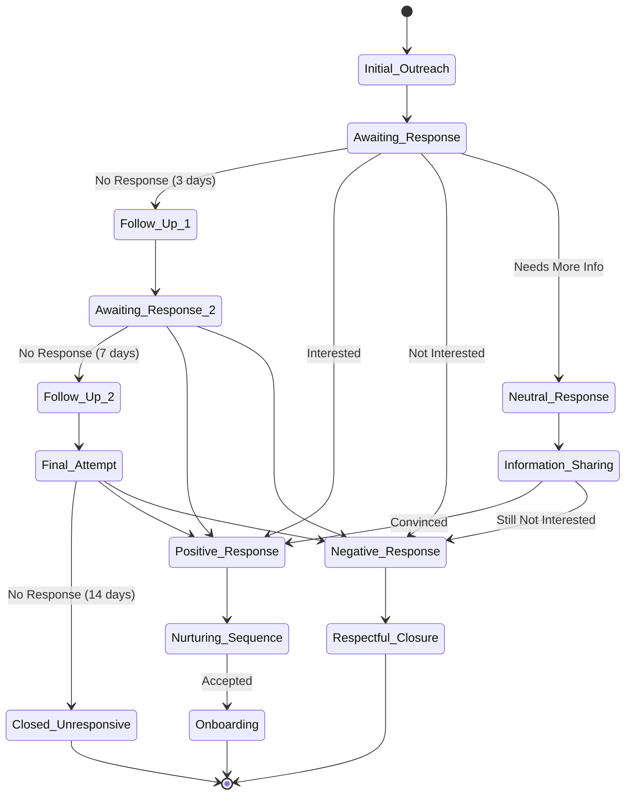

# Advanced Outreach Features

This module implements advanced features for the Agentic Affiliate Outreach System, including conversation flow management, timing optimization, and message quality assurance.

## Components

### 1. Conversation Flow Management

The conversation flow manager handles the entire lifecycle of outreach conversations, following a state-based approach:



#### Usage

```python
from services.outreach.conversation import ConversationFlowManager

# Initialize manager
flow_manager = ConversationFlowManager(
    monitoring_service=monitoring_service,
    personalization_engine=personalization_engine,
    timing_optimizer=timing_optimizer
)

# Start conversation
conversation = await flow_manager.start_conversation(
    prospect_id="prospect_123",
    initial_message="Hello, I'm interested in connecting.",
    channel="linkedin"
)

# Update conversation state
await flow_manager.update_conversation_state(
    conversation["id"],
    ConversationState.POSITIVE_RESPONSE,
    response_data={
        "content": "Yes, I'd be interested in connecting.",
        "sentiment": "positive",
        "intent": "accept"
    }
)
```

### 2. Timing Optimization

The timing optimizer ensures messages are sent at optimal times based on various factors:

- Time zone awareness
- Platform-specific optimal times
- Individual preference learning
- Seasonal and trend-based timing
- Real-time engagement monitoring

#### Usage

```python
from services.outreach.timing import TimingOptimizer

# Initialize optimizer
timing_optimizer = TimingOptimizer(
    monitoring_service=monitoring_service,
    analytics_service=analytics_service
)

# Get optimal send time
optimal_time = await timing_optimizer.get_optimal_send_time(
    prospect_id="prospect_123",
    channel="linkedin",
    timezone="America/New_York"
)

# Update preferences
await timing_optimizer.update_preferences(
    prospect_id="prospect_123",
    engagement_data={
        "best_days": ["Monday", "Wednesday"],
        "best_hours": [10, 11],
        "response_times": [30, 45]  # minutes
    }
)
```

### 3. Message Quality Assurance

The message quality assurance system ensures high-quality messages through:

- Grammar and spell checking
- Tone analysis and adjustment
- Cultural sensitivity screening
- Spam filter testing
- Brand voice consistency

#### Usage

```python
from services.outreach.quality import MessageQualityAssurance

# Initialize QA system
message_qa = MessageQualityAssurance(
    monitoring_service=monitoring_service,
    analytics_service=analytics_service
)

# Check message quality
quality_report = await message_qa.check_message_quality(
    message="Hello, I'm interested in connecting.",
    channel="linkedin",
    brand_voice={
        "tone": "professional",
        "formality": "high",
        "personality": "friendly"
    }
)

# Optimize message
optimized_message = await message_qa.optimize_message(
    message="Hello, I'm interested in connecting.",
    quality_report=quality_report
)
```

## Integration

The components work together to provide a comprehensive outreach solution:

1. **Conversation Flow + Timing**
   - Automatic follow-ups at optimal times
   - Timezone-aware scheduling
   - Preference-based timing

2. **Conversation Flow + Quality**
   - Quality-checked messages
   - Brand voice consistency
   - Cultural sensitivity

3. **Timing + Quality**
   - Platform-specific optimization
   - Engagement-based timing
   - Quality-based scheduling

## Error Handling

Each component implements comprehensive error handling:

```python
try:
    # Operation
    result = await component.operation()
except ComponentError as e:
    # Handle specific errors
    logger.error(f"Operation failed: {str(e)}")
    # Take appropriate action
except Exception as e:
    # Handle unexpected errors
    logger.error(f"Unexpected error: {str(e)}")
    # Take fallback action
```

## Metrics

The components record various metrics:

1. **Conversation Flow**
   - State transition times
   - Response rates
   - Follow-up effectiveness
   - Conversation duration

2. **Timing**
   - Optimal time accuracy
   - Preference learning rate
   - Engagement timing
   - Timezone effectiveness

3. **Quality**
   - Grammar scores
   - Tone consistency
   - Cultural sensitivity
   - Spam filter results

## Testing

Integration tests are available in `tests/integration/test_advanced_outreach.py`:

```python
pytest tests/integration/test_advanced_outreach.py
```

## Contributing

To add new features:

1. **Conversation Flow**
   - Add new states
   - Implement state transitions
   - Add state-specific actions

2. **Timing**
   - Add new timing factors
   - Implement preference learning
   - Add platform-specific rules

3. **Quality**
   - Add new quality checks
   - Implement optimization rules
   - Add brand voice rules

## Best Practices

1. **Conversation Flow**
   - Handle all state transitions
   - Implement proper timeouts
   - Track conversation progress
   - Clean up resources

2. **Timing**
   - Consider timezone differences
   - Learn from engagement data
   - Adapt to platform rules
   - Monitor effectiveness

3. **Quality**
   - Check all quality aspects
   - Maintain brand voice
   - Ensure cultural sensitivity
   - Prevent spam triggers 